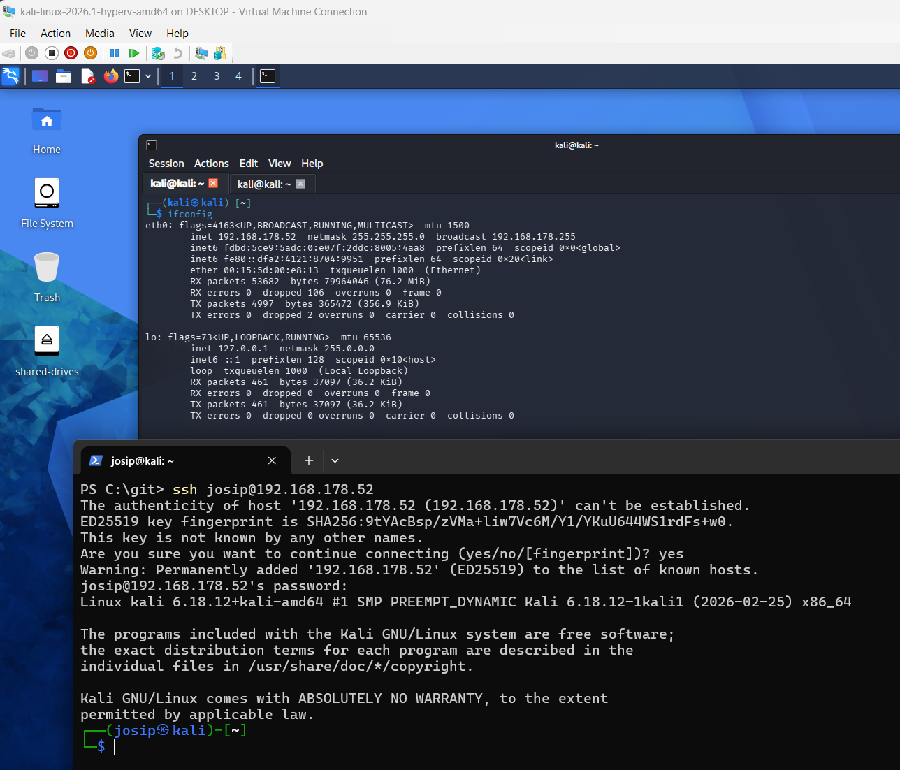
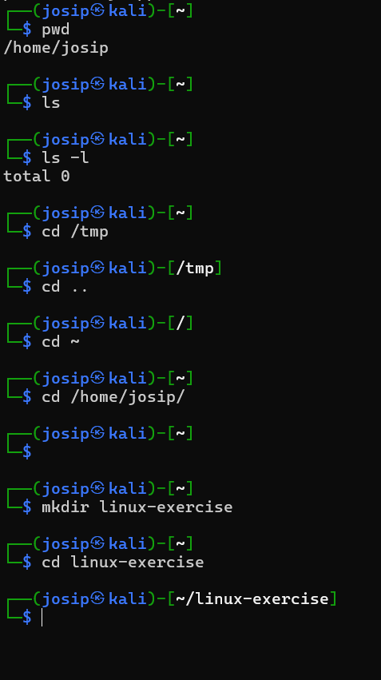
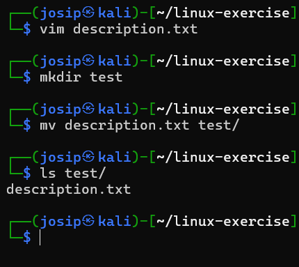
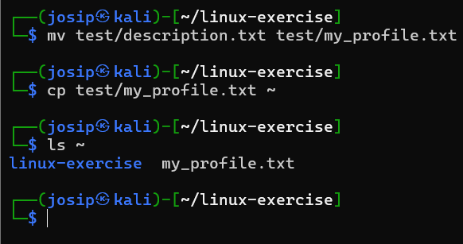
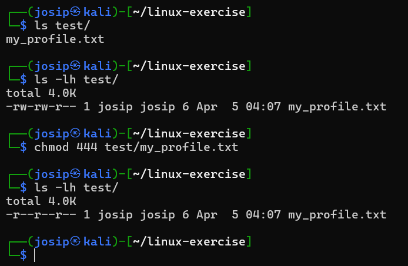
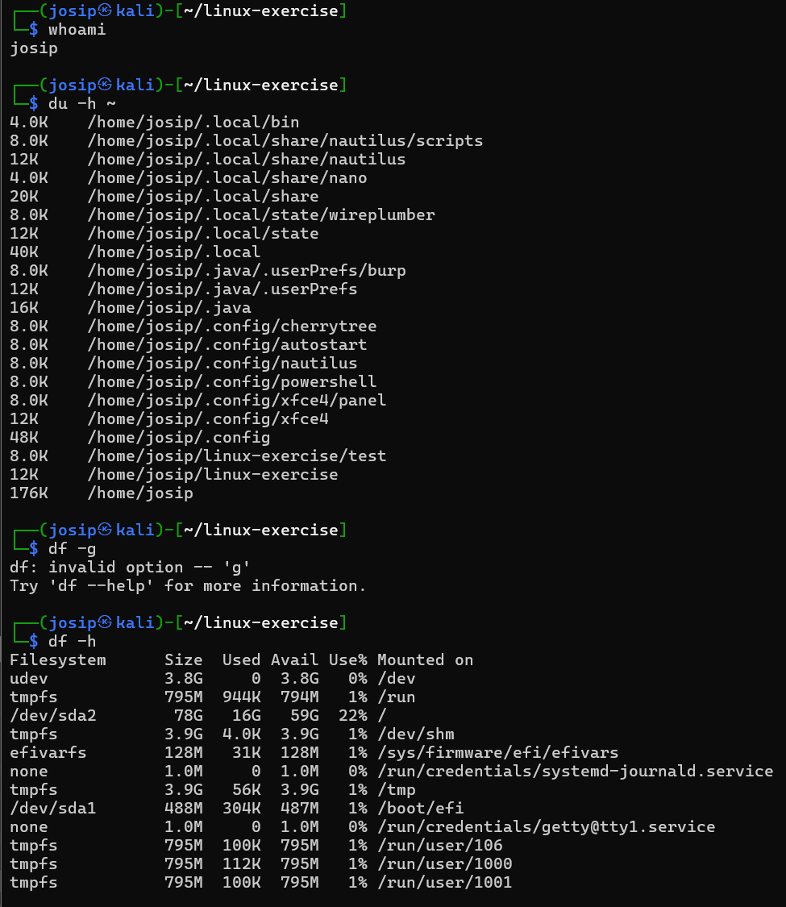
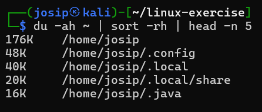

# 🐧 Introduction to Linux: Basics of Working in the Command Line

In the first part, we will take a closer look (and repeat) at working with the command line in the Linux OS.

Linux is an open source operating system similar to Unix. Unix was developed in the 1970s at Bell Labs. At the time, it was considered the first multi-user, multi-tasking operating system. It was developed at the University of Berkeley and became known as the "Berkley Software Distribution" or BSD. Today, MacOS is also very similar to it, which comes from the BSD family, specifically FreeBSD.

Linux refers to the name of the operating system kernel. There are many distributions available that are based on the Linux kernel: Debian, Ubuntu, Fedora, CentOS, Kali Linux, Arch Linux, ...

## 🎯 Objective
To learn the basics of working with the command line in a Linux environment.

In this tutorial, we will learn how to:
✅ execute basic commands in Linux
✅ browse directories, create directories and files
✅ connect to a Linux server via ssh

---

## ⚙️ Prepare the environment

For this tutorial, we will use [GitHub Codespaces](https://github.com/features/codespaces)

GitHub Codespaces is a development environment hosted in the cloud. It is intended for project development, where we connect to the GitHub repository, which allows us to develop within a web browser, and we can also access a virtual environment.

It is recommended that you prepare your own virtual environment for the needs of the tutorials by next time, either:
- within a virtual environment (VMWare, VirtualBox, etc.)
- Windows Subsystem for Linux (WSL)
- Microsoft Azure or another cloud service
- an existing environment if you use Linux OS/Max OS X/BSD, etc.

It is recommended that you install the Kali Linux distribution, which already includes all the tools we will use in the exercises.

---

## 🧪 Creating a Github Codespace environment:

1. On the link [GitHub Codespaces](https://github.com/features/codespaces) select the option "Get started for free"

2. On the left side or via quick access, select the option "Blank"

3. Github Codespaces will create a web environment for us through which we can access the command line.

By default, Github Codespaces does not allow access via SSH, so we will use a trick and arrange access via SSH. For a production solution, I do not recommend this approach, use gh cli instead. The above part serves only as a demonstration.

First, create a user with whom we will work, so that we do not use the default user.

```bash
whoami # check the current user
sudo adduser user # user is your desired username, the wizard will ask us for the password and user data, which we confirm. Attention: the password is not visible when we log in.
sudo usermod -aG sudo user
sudo visudo
```

Add the following entry under # User privilege specification
```bash
user ALL=(ALL:ALL) ALL
```

Now we start the SSH service
```bash
sudo service ssh start # start the ssh service
sudo apt update # update the package list
sudo apt install tmate # install the tmate package
tmate # start tmate
```

The information for connecting to ssh via a special session is displayed. With Ctrl + C we interrupt the display and gain access to using the command line.

## 🧪 Connecting to the server

We can log in to the server from the offending shell.
```bash
su - user # switch to the user we created and enter the password
```

## 🧪 Exercise: Basic commands



### 1️⃣ Navigating the system
```bash
pwd # display the current path
ls # display the contents of a directory
ls -l # display the contents with details
cd /path/to/directory # change directory
cd .. # move to the parent directory
```

✅ **Task:**
- Move to your home directory.
- Create the `linux-exercise` directory.
- Enter it.


---


### 2️⃣ Working with files and directories
```bash
mkdir newFolder # create a new directory
touch file.txt # create an empty file
nano file.txt # edit the contents (or `vim` / `code`)
cat file.txt # list the contents
rm file.txt # delete the file
rm -r newFolder # delete the directory with the contents
```

✅ **Task:**
- Create the file `description.txt` and write your name in it.
- Create the directory `test`.
- Move `description.txt` to `test`.


---


### 3️⃣ Moving and copying
```bash
mv dat.txt other.txt # rename the file
cp file1.txt file2.txt # copy the file
mv file.txt /path/to/otherfolder/ # move
```
✅ **Task:**
- Rename `description.txt` to `my_profile.txt`.
- Copy `my_profile.txt` to your home folder.


---

### 4️⃣ Permissions and Sizes
```bash
ls -lh # size and permissions
du -sh ./* # file/directory size
chmod 644 file # change permissions
```

✅ **Task:**
- Check the size of all files in the folder.
- Change the permissions of the file `my_profile.txt` to be read-only for everyone.


---

### 5️⃣ View System Information
```bash
whoami # your username
uname -a # system information
df -h # disk usage
top # active processes
```

✅ **Task:**
- Find out your username and the size of your home directory.
- Check how much space is available on your system.


---

## 💡 Extra task
Find the largest file in your home directory:

```bash
du -ah ~ | sort -rh | head -n 5
```



## References

1. Reddit, SSH into Codespace without GitHub CLI, https://www.reddit.com/r/github/comments/15pvnj3/comment/kd23ess/

2. OpenAI, (2025), *ChatGPT* (Aug 2025) [Large language model], https://chat.openai.com/