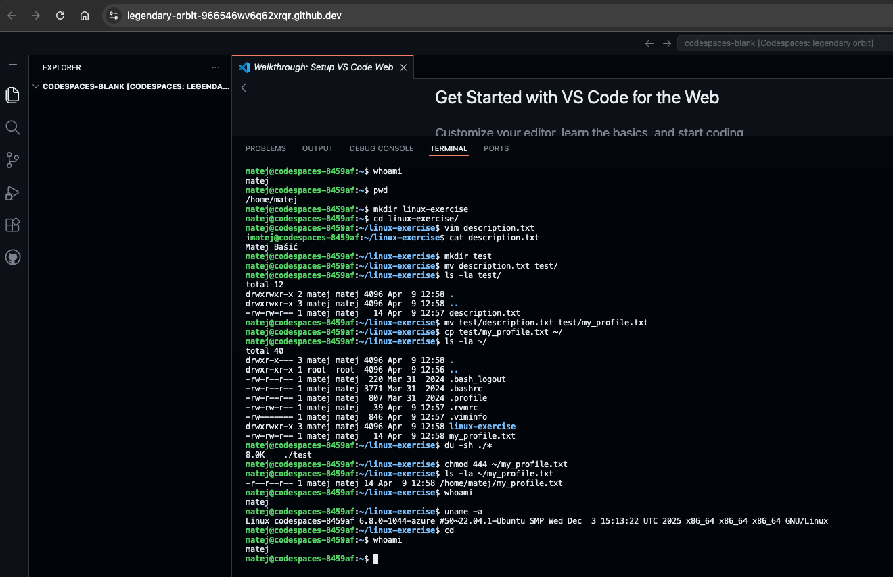

# LAB00 Solution

## Screenshot



## 1. Navigating the system

```bash
pwd
cd ~
mkdir linux-exercise
cd linux-exercise
```

## 2. Working with files and directories

```bash
touch description.txt
nano description.txt   # write your name, save with Ctrl+O, exit with Ctrl+X
mkdir test
mv description.txt test/
cat test/description.txt
```

## 3. Moving and copying

```bash
mv test/description.txt test/my_profile.txt
cp test/my_profile.txt ~/
ls -la ~/
```

## 4. Permissions and sizes

```bash
ls -lh
chmod 444 ~/my_profile.txt
ls -la ~/my_profile.txt
```

`444` sets read-only for owner, group, and others (`r--r--r--`).

## 5. View system information

```bash
whoami
du -sh ~/
df -h
uname -a
```

## Extra task: Largest files in home directory

```bash
du -ah ~ | sort -rh | head -n 5
```
