# Introduction to Kali Linux

In this tutorial, you will learn about the **Kali Linux** distribution, which is the standard Linux distribution for security testing and ethical hacking. You will learn about the purpose of using Kali Linux, its main tools, and basic concepts that every security professional should know.

# 🧪 Introduction to Kali Linux

Kali Linux is a specialized Linux distribution used by security professionals to perform penetration testing, network analysis, forensic analysis, and other security tasks. It contains more than 600 pre-installed tools.
Knowing the Kali Linux environment is important because it allows you to perform attack simulations and discover vulnerabilities before attackers exploit them.

---

## 1️⃣ Introduction

The goal of the exercise is for us as users to learn how to:
✅ understand the purpose and role of Kali Linux in cybersecurity
✅ get to know the basic graphical and command environment of Kali Linux
✅ find and run some key tools
✅ execute basic commands and analyze the results

---

## 2️⃣ Working with Kali Linux

### 🖥️ Instructions

In the following, we will look at how to install and run Kali Linux. We will also look at some basic commands.

---

#### 1️⃣ Installing Kali Linux

Basic information about Kali Linux can be found at: [https://www.kali.org](https://www.kali.org)

Instructions for installing Kali Linux are available at: [https://www.kali.org/docs/installation/](https://www.kali.org/docs/installation/)

Kali Linux download images can be found at: [https://www.kali.org/get-kali/#kali-platforms](https://www.kali.org/get-kali/#kali-platforms)

I recommend using it inside a VMWare or VirtualBox virtual environment.

On Windows, you can install Kali Linux in the WSL environment: [https://www.kali.org/get-kali/#kali-wsl](https://www.kali.org/get-kali/#kali-wsl)

On Mac OS X, I suggest using WMware Fusion [https://www.kali.org/docs/virtualization/install-vmware-silicon-host/](https://www.kali.org/docs/virtualization/install-vmware-silicon-host/)

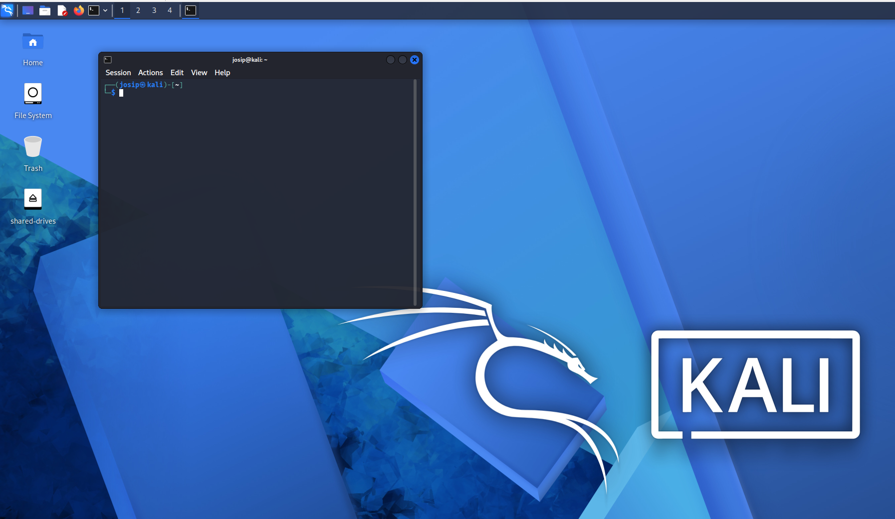
---

#### 2️⃣ Starting the Kali Linux environment

Kali Linux uses the Xfce graphical environment, other graphical environments are also available within the Linux OS: GNOME, KDE, Cinnamon, Pantheon, ...

Explore the Kali Linux graphical environment:
- Start the virtual environment with **Kali Linux**.
- Explore the graphical environment (menus, system information).
- Find the security tools menu and review the 5 tools you find.
- find operating system settings
- sort file system

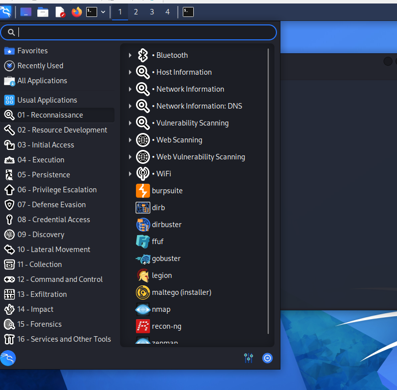
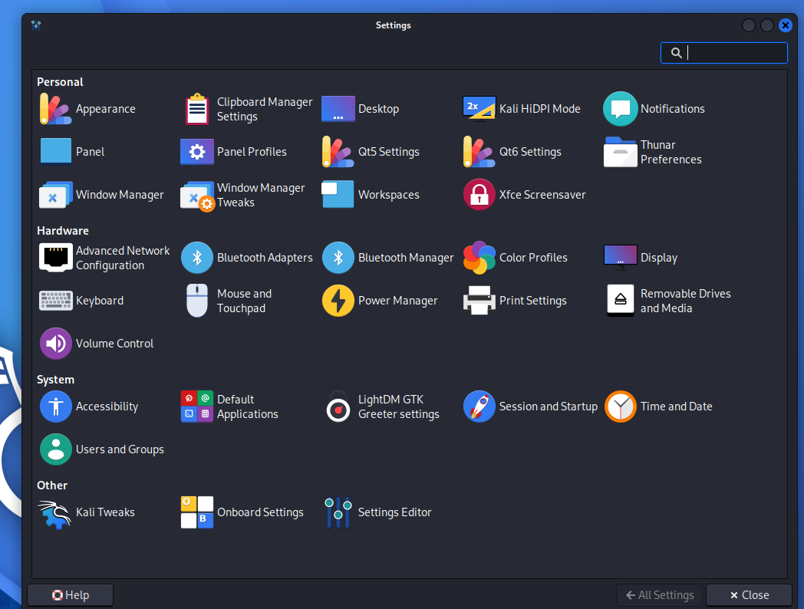
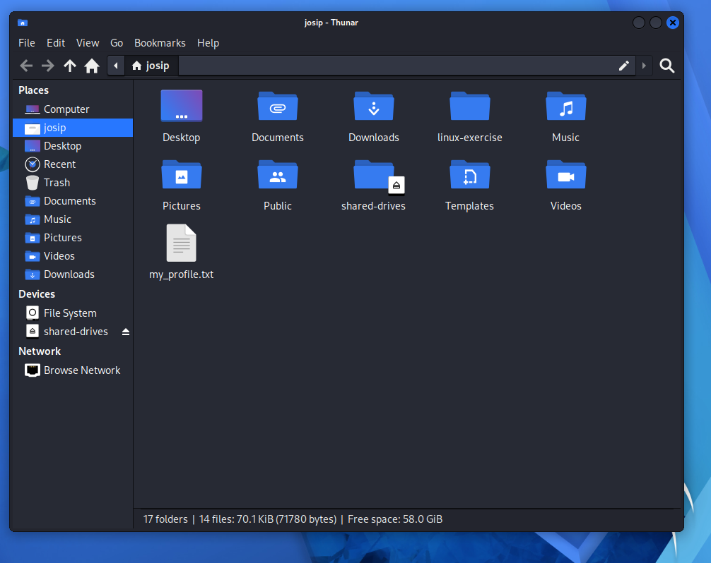

Burp Suite — A web application security testing proxy that intercepts, inspects, and modifies HTTP/HTTPS traffic between a browser and server.
dirb — A web content scanner that brute-forces directory and file names on a web server using a wordlist.
Maltego — An OSINT and link-analysis tool that visually maps relationships between people, domains, IPs, and other entities from public data sources.
Legion — A network penetration testing framework that automates service enumeration and vulnerability scanning on discovered hosts.
nmap — A network scanner that discovers hosts, open ports, running services, and OS details on a network.

---

#### 3️⃣ Basic Command Line Commands
Open **terminal** and run the following commands and record the results.

| Command | Meaning |
|--------------------|------|
| `whoami` | Show logged in user |
| `hostnamectl` | Show hostname and OS |
| `uname -a` | Show kernel information |
| `df -h` | Show disk usage |
| `ip a` | Show network settings |
| `wget url` | Download files from URL |
| `sudo apt install package_name` | Install packages using APT |

Example:
```bash
whoami
hostnamectl
uname -a
df -h
ip a
wget https://gist.githubusercontent.com/EdwardRayl/3436572afde8ce9e3faf5b7b95356a49/raw/6b25895fce480713560829dec31ac8220ffe5272/gists.txt
sudo apt install 7zip
which nmap
which john
cd /
ls -la
```
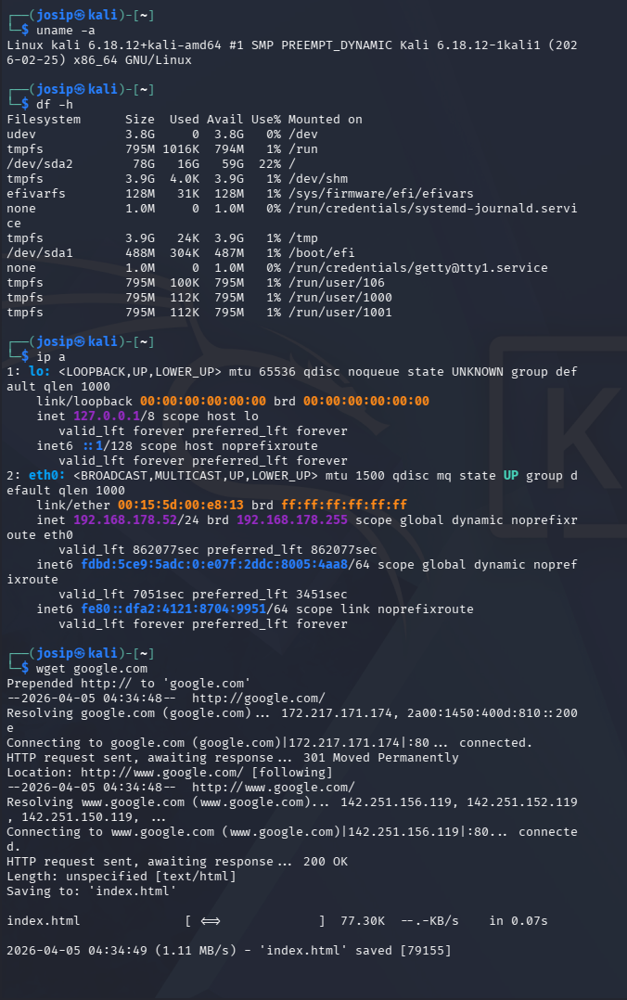
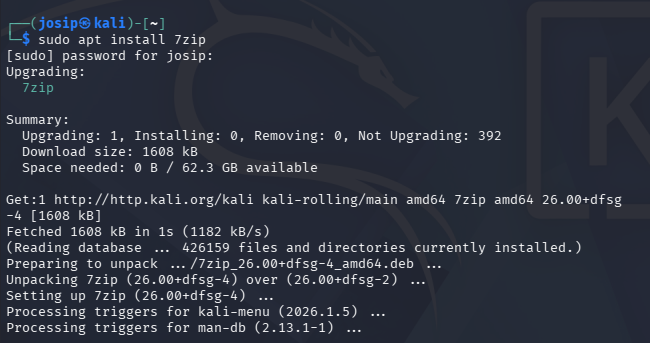

HTOP is a simple system diagnostics package. You can also try the btop package. The packages show the usage of system resources and processes, which helps us identify suspicious processes that may be running in the background.

```bash
htop
sudo apt install htop # install htop
htop
```
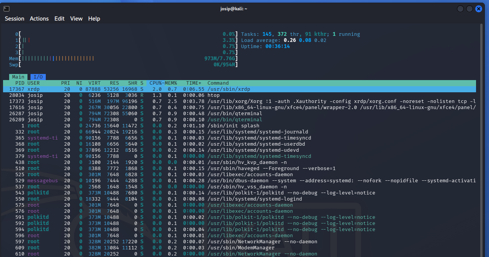

Traceroute is a basic tool for checking network connectivity. Using the tool, we can print the path that packets take through the network and identify potential problems in network nodes.

```bash
htop
sudo apt install traceroute -y # install traceroute
traceroute google.com
```
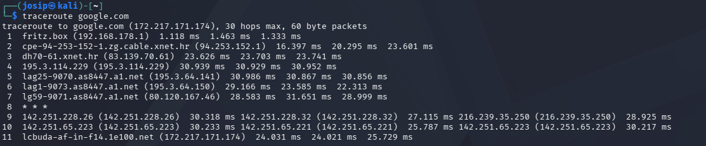

For a graphical display of upload/download network traffic on the network, we can use the nload package.

```bash
sudo apt install nload -y
nload
```
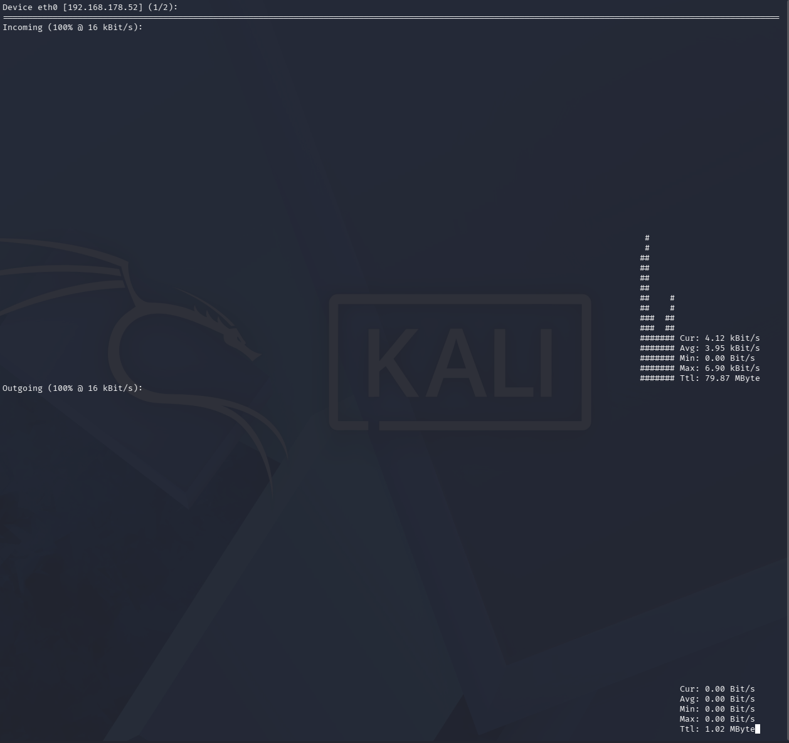

For simple forensics, we can use the strings package, which can be used to read strings of ASCII or unicode characters from binary files that are readable. The technique is used in reverse engineering and digital forensics.

```bash
strings /bin/ls | head
```
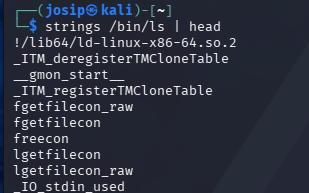

#### 3️⃣ Using tools in Kali Linux

In the following, we will look at and introduce some of the basic tools available within Kali Linux.

First, we will check the data transfer speed using the speedtest-cli package.

```bash
sudo apt install speedtest-cli -y
speedtest-cli --secure
```
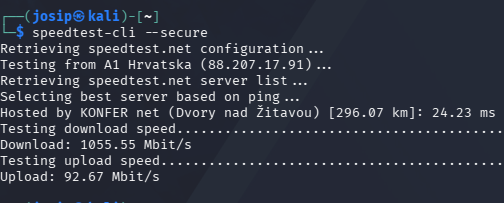

We often need to monitor network traffic for forensic analysis or diagnostics, this can also be done using the tcpdump package.

```bash
sudo tcpdump -c 10
```
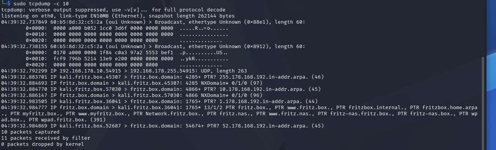

NMAP and ZenMAP are useful tools for the scanning phase in Kali Linux. NMAP and ZenMAP are practically the same tools, but NMAP uses the command line, while ZenMAP has a graphical user interface.

Nmap allows you to scan by IP address. It also allows you to identify the operating system of the IP device using the -O flag.
```bash
nmap -O 192.168.1.101 # scan by operating system
nmap -p 1-65535 -T4 192.168.1.1 # scan for open TCP and UDP ports
nmap -sS -T4 192.168.1.11 # stealth-scan using SYN/ACK.
```
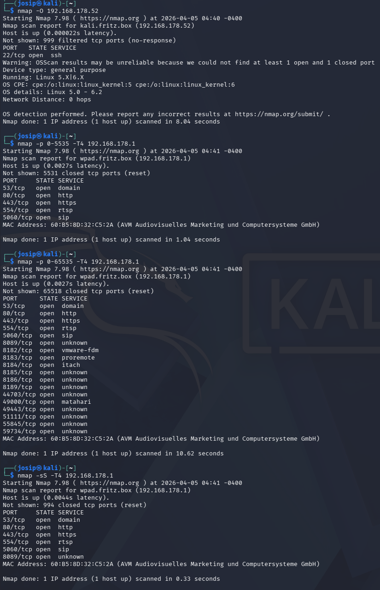

Searchsploit is a search engine for detected vulnerabilities

```bash
searchsploit wordpress ftp # search for detected vulnerabilities in Wordpress FTP extensions
```

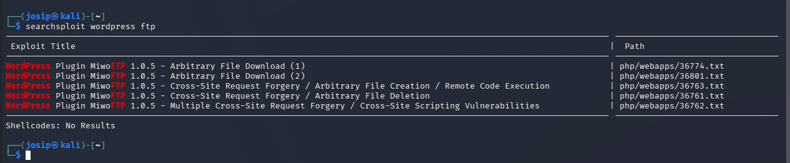

Dnsenum is a script for searching the DNS data of a domain and discovering IP addresses. The main purpose of Dnsenum is to collect as much information about a domain as possible.

```bash
dnsenum google.com # run DNS query
```
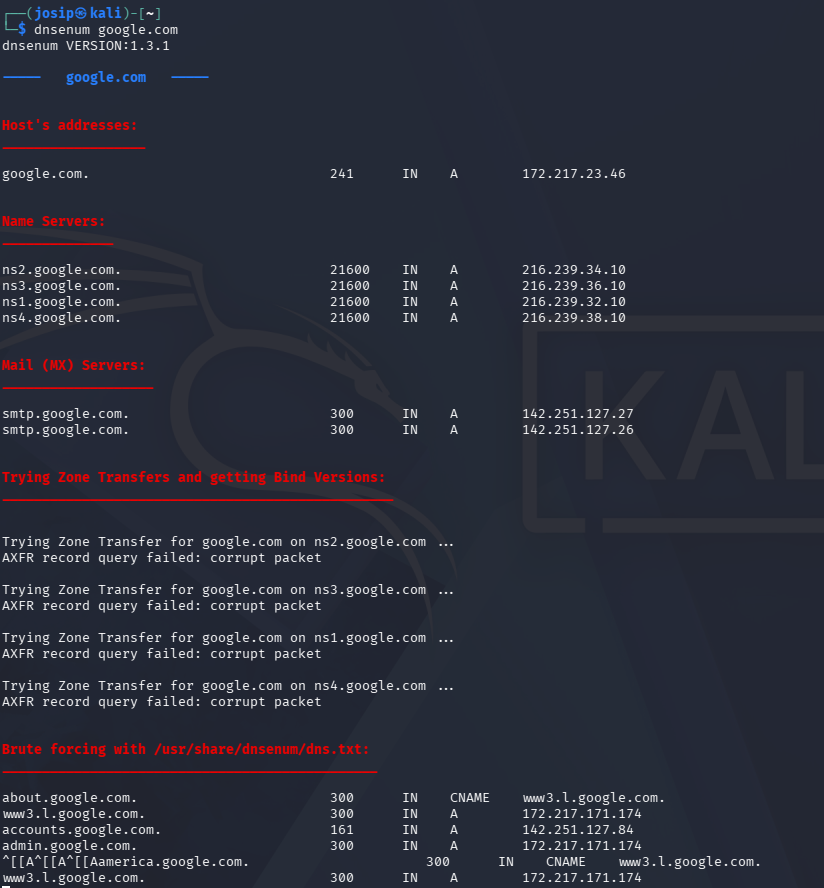

The LBD (Load Balancing Detector) tool allows you to detect whether a specific domain uses a Load Balancer or HTTP.

```bash
lbd google.com # check LB
```

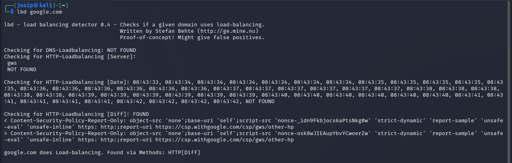
Name-That-Hash is a tool that allows you to identify the obtained hash value of a string.

```bash
nth
sudo apt install name-that-hash # install nth
nth -t ef487f75307f96954d3bb132e5f4b035
```

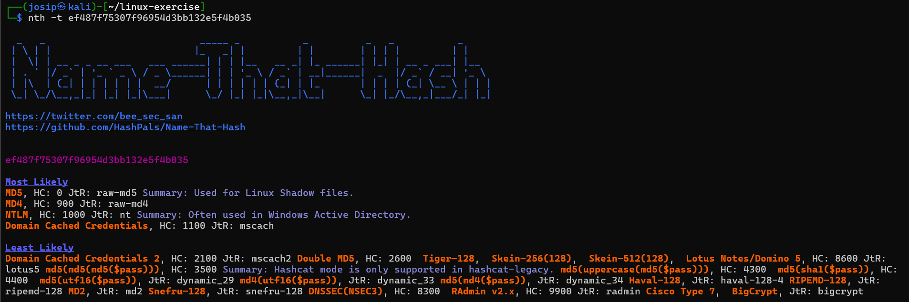
⸻

## 3️⃣ Reflection and Analysis
• Why do we use Kali Linux? What is the advantage of Kali Linux compared to other Linux distributions?
It is a Debian-based distribution purpose-built for penetration testing and security auditing, coming pre-installed with hundreds of security tools (Nmap, Metasploit, Wireshark, Burp Suite, etc.). We use it because it is preconfigured with pentest tools and most of the unnecessarty services are disabled.

• Which features and tools of Kali Linux attracted you the most? Most of the tools are preconfigured, so no searching github for all of them.

## References

1. Kali Linux., *Penetration Testing Distribution*, https://www.kali.org/
2. OpenAI, (2025), *ChatGPT* (Aug 2025) [Large language model], https://chat.openai.com/