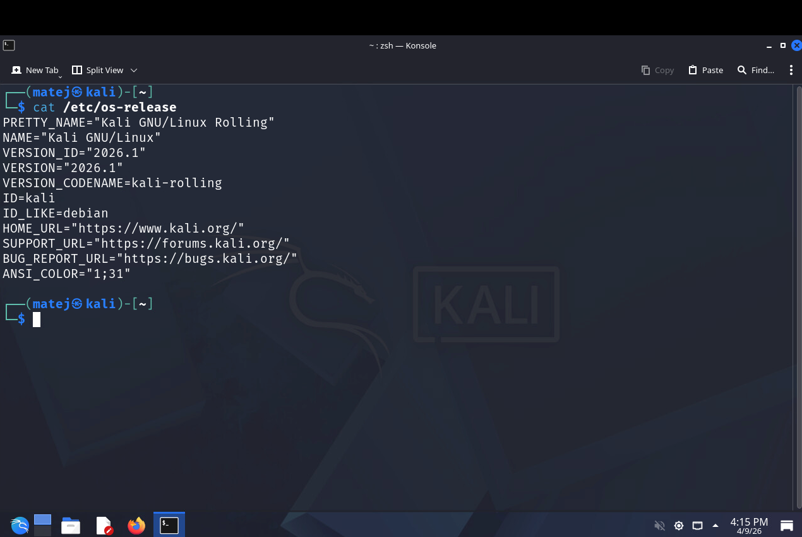
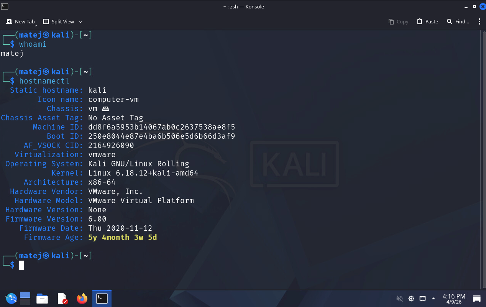
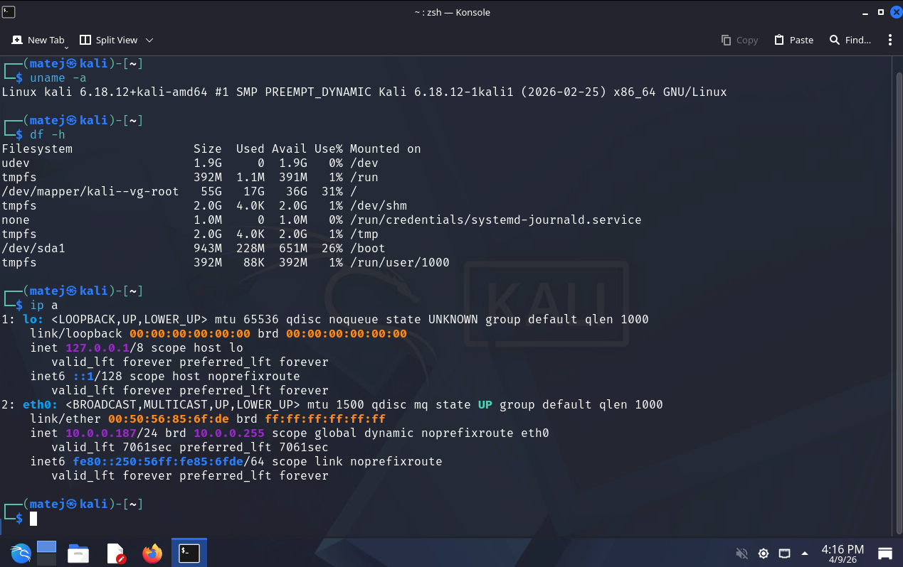
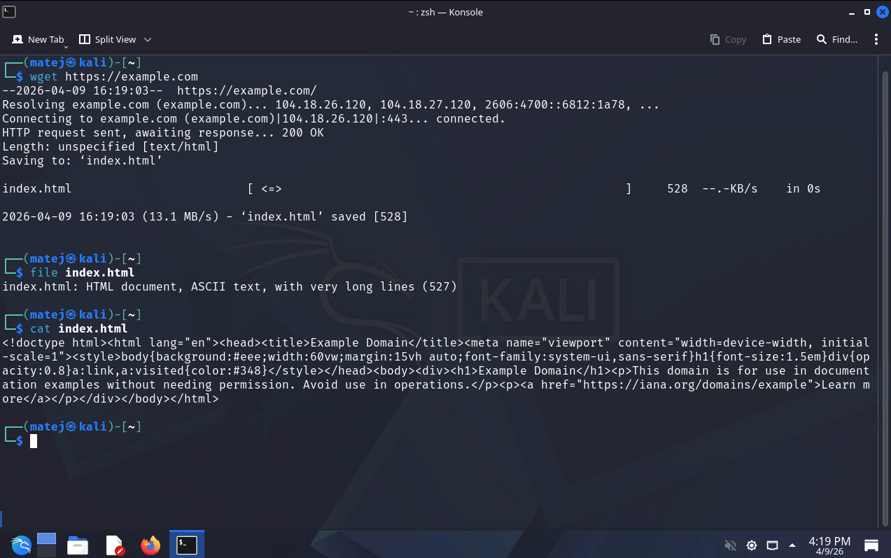
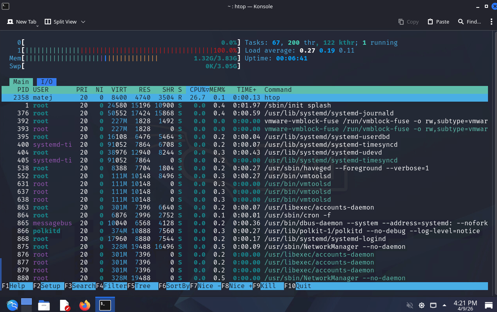
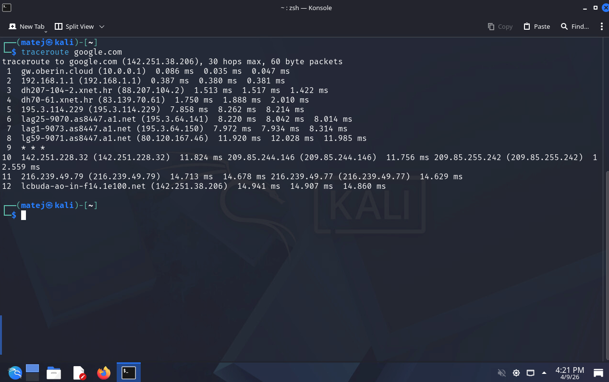
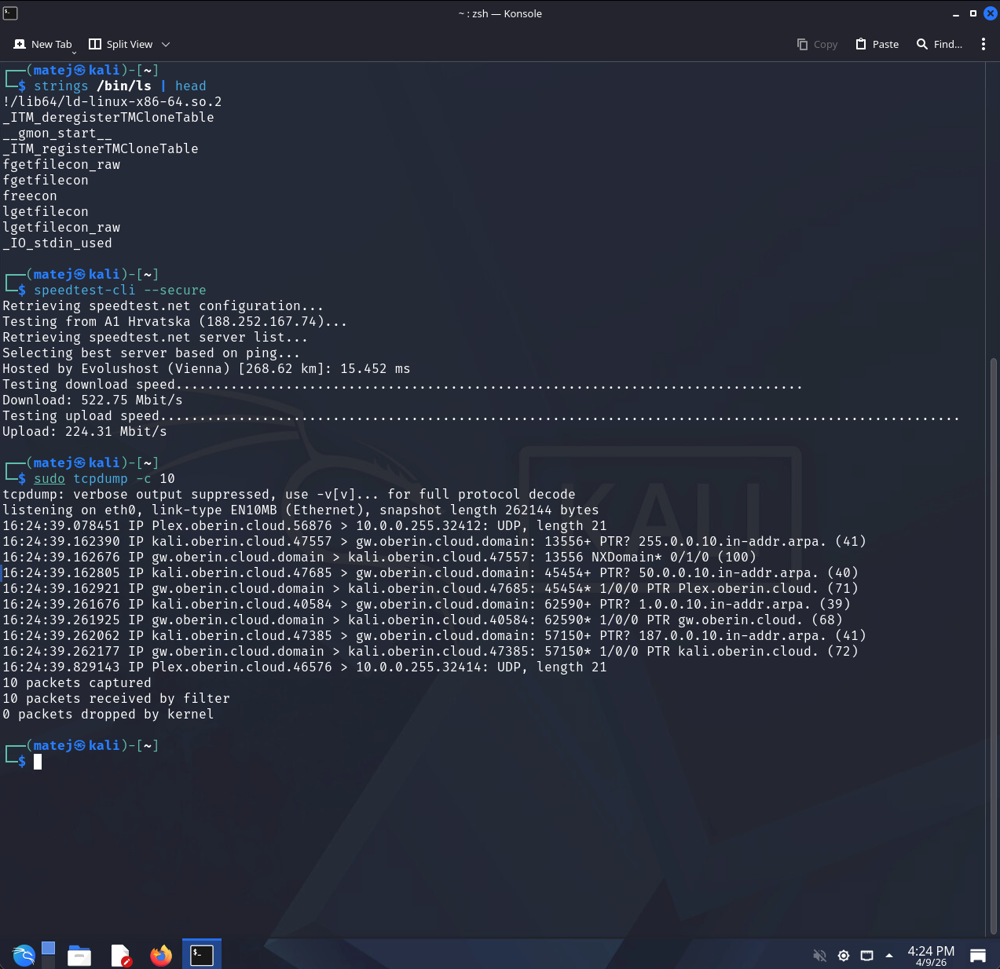
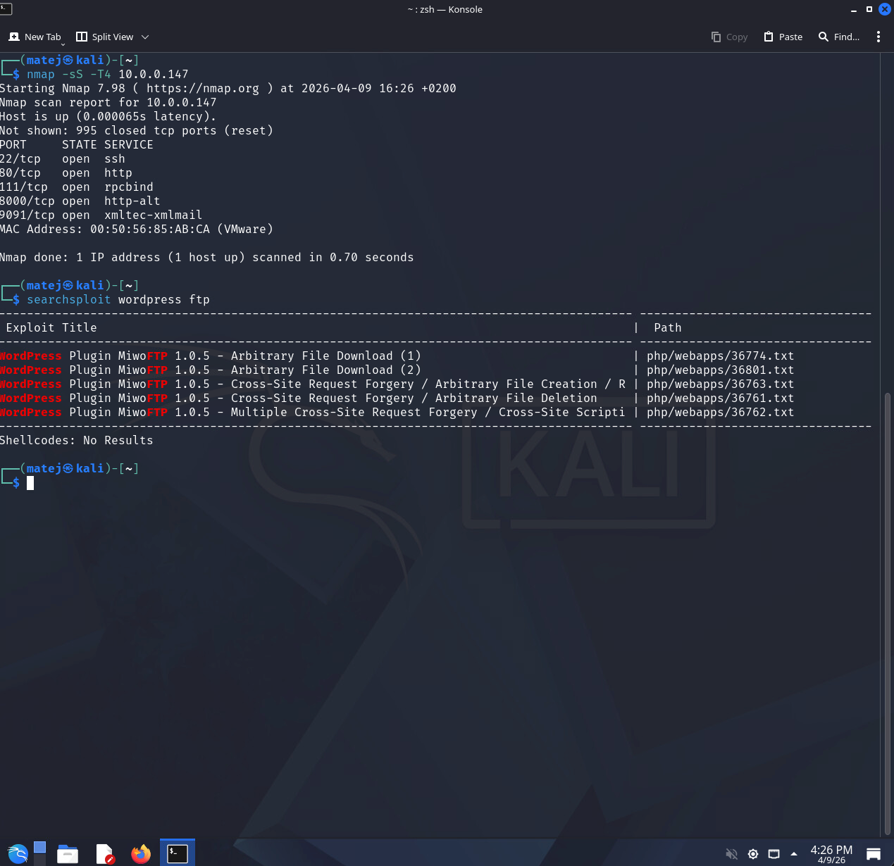
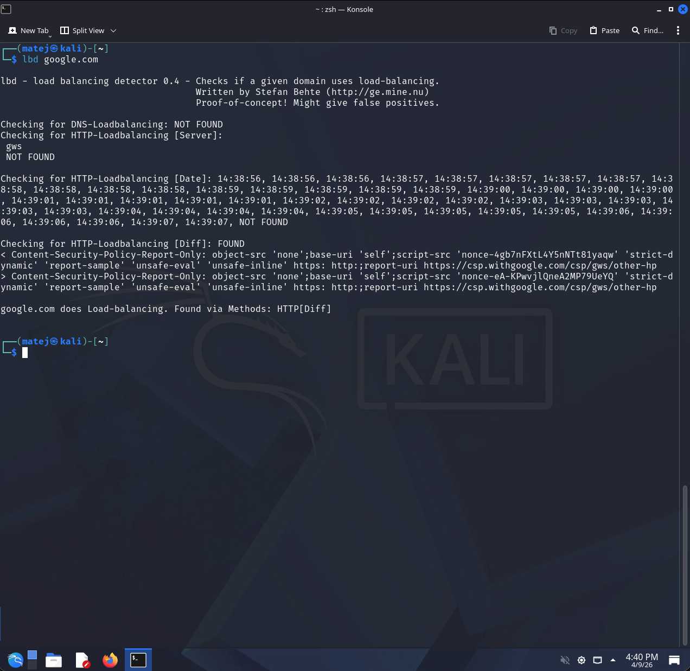

# LAB01 Solution

## 1. Installing and starting Kali Linux

Kali Linux was installed as a virtual machine in VMware. The OS version was confirmed with:

```bash
cat /etc/os-release
```



---

## 2. Basic command line commands

### whoami & hostnamectl

```bash
whoami
hostnamectl
```



### uname -a, df -h, ip a

```bash
uname -a
df -h
ip a
```



### wget

```bash
wget https://example.com
file index.html
cat index.html
```



### htop

```bash
htop
```



### traceroute

```bash
traceroute google.com
```



### strings, speedtest-cli, tcpdump

```bash
strings /bin/ls | head
speedtest-cli --secure
sudo tcpdump -c 10
```



---

## 3. Using tools in Kali Linux

### nmap & searchsploit

```bash
nmap -sS 10.0.0.147
searchsploit wordpress ftp
```



### lbd

```bash
lbd google.com
```



---

## 4. Reflection and Analysis

**Why do we use Kali Linux? What is the advantage over other distributions?**

Kali Linux is purpose-built for penetration testing and security research. Its main advantage is that it comes with over 600 pre-installed security tools (nmap, Metasploit, Wireshark, John the Ripper, etc.), so there is no need to manually install and configure each tool. It is maintained by Offensive Security and regularly updated with new tools and exploit databases. Compared to a general-purpose distribution like Ubuntu, Kali saves significant setup time in a security context and provides a standardized environment that the security community uses.

**Which features and tools attracted you the most?**

The most interesting tools encountered in this lab were:
- **nmap** — the ability to quickly scan a host and identify open ports and services is fundamental to any network assessment.
- **searchsploit** — being able to search the Exploit Database offline is very practical; it immediately shows known vulnerabilities for a given service or software.
- **tcpdump** — a lightweight but powerful tool for capturing live network traffic, useful for both diagnostics and forensic analysis.
- **lbd** — a simple but clever tool; detecting load balancers is a useful recon step since it reveals infrastructure details that affect how further testing should be approached.
