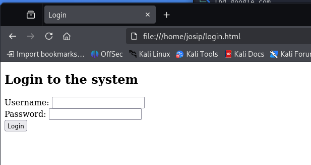
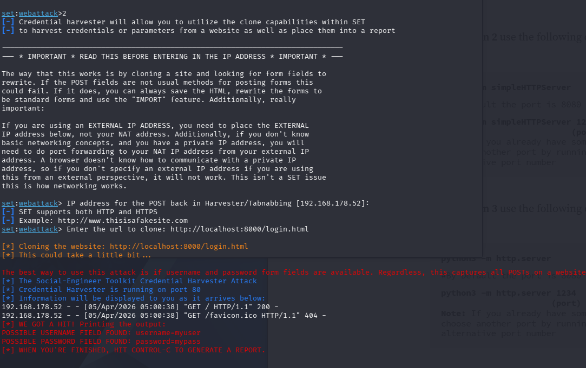
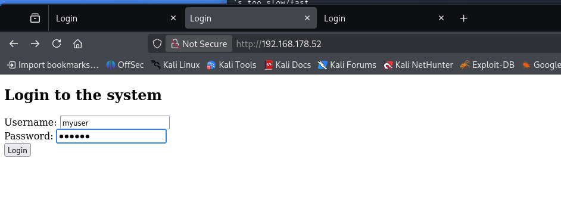

# Identifying and Preventing Phishing Attacks

In this exercise, you will learn how phishing attacks work, how to recognize them, and why they are dangerous. You will practically simulate a phishing attack using the Social Engineering Toolkit (SET) and a simple form, and analyze the captured data.

# 🧪 Identifying and Preventing Phishing Attacks

Phishing is one of the most common social engineering techniques used by attackers to trick users into entering their login information on a fake page. The goal of this exercise is to learn what such pages look like, how they work, and the importance of recognizing the signs of an attack.

---

## 1️⃣ Introduction

The goal is for users to learn how to:
✅ recognize typical signs of a phishing site
✅ simulate a phishing attack using SET
✅ analyze the captured data and understand the limitations
✅ raise awareness of the importance of checking URLs and security indicators

---

## 2️⃣ Activity

### 🖥️ Instructions

Students will perform the following steps and document the results:

---

#### 1️⃣ Preparing the test form
- Create a file `login.html` on your computer with the following content:
```html
<!DOCTYPE html>
<html lang="sl">
<head>
<meta charset="UTF-8">
<title>Login</title>
</head>
<body>
<h2>Login to the system</h2>
<form method="POST" action="">
Username: <input type="text" name="username"><br>
Password: <input type="password" name="password"><br>
<input type="submit" value="Login">
</form>
</body>
</html>
```

Open the saved page in your browser — this is a simple login form that we will use as a target.

---

#### 2️⃣ Launch SET and clone the site
- Launch SET:
```bash
sudo setoolkit
```

- Select the menus:
```
1) Social-Engineering Attacks
2) Website Attack Vectors
3) Credential Harvester Attack Method
2) Site Cloner
```

- When asked for an IP address to capture data, enter your local IP address (e.g. `192.168.x.x`) or leave the suggested one.

- For the cloning URL, enter the path to your `login.html`:
```
file:///home/youruser/login.html
```

- SET will prepare a fake page and start listening on port 80.

---

#### 3️⃣ Testing
- Open a browser and visit the address:
```
http://<your_IP>
```
- Enter the test data (e.g. user: `test`, password: `password123`).

- In the SET terminal, you will see the captured data:
```
[*] WE GOT A HIT!
username: test
password: password123
```

I was not able to clone local file so I used http.server module to create a webpage



---

### 📝 Analysis and Report

Submit a report with the following content:
- Screenshot of the fake login page
- Screenshot of the terminal with the captured data
- A brief description of how the victim would recognize that it is a phishing page - Victim can recognize it based on domain name, possibly by certificate and that is pretty much it. It can also discover redirect to another domain after doing post. Maybe by analyzing who owns the website IP but it can be a cloud provider and not much of things you can do.

---

## 3️⃣ Reflection and Analysis

- What are the characteristics of phishing pages (e.g., a wrong URL)?
Characteristics of phishing pages: They mimic legitimate sites but have  signs like misspelled or lookalike domains (e.g., paypa1.com), missing HTTPS, mismatched SSL certificates, and copied but slightly off branding.

- How would you protect yourself from such an attack?
Always verify the exact URL in the address bar before entering credentials, use a password manager (which won't autofill on fake domains), and enable multi-factor authentication.

- Why do modern sites make such attacks more difficult?
Why modern sites make it harder: They use HTTPS with strict certificates (HSTS), anti-phishing browser warnings, FIDO2/passkeys tied to the exact origin domain, and CSP headers — all of which break or expose fake replicas.
---

📄 *Note: This exercise is for educational purposes only. Never perform these techniques on real users without their knowledge and permission.*