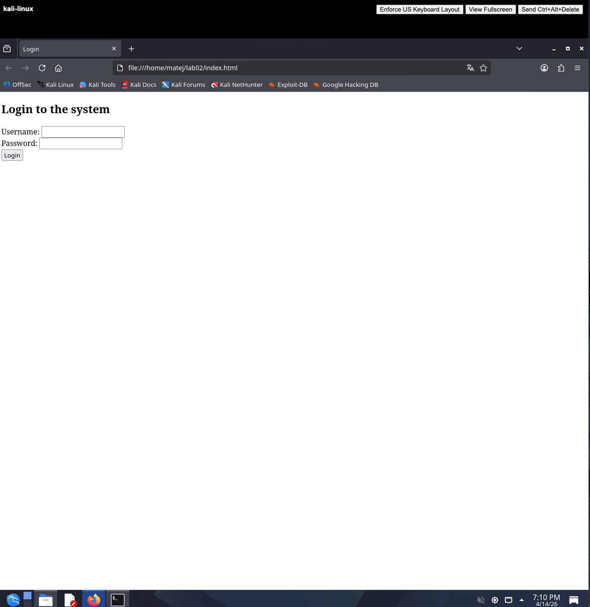
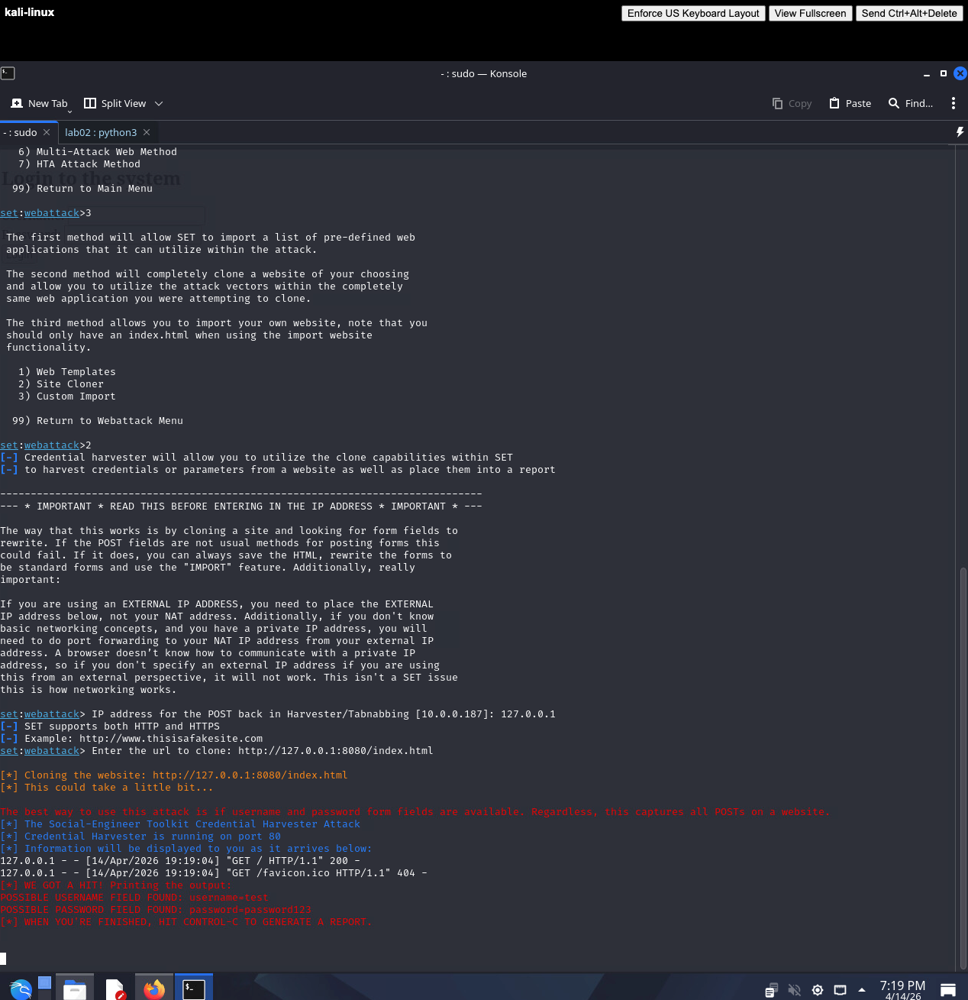
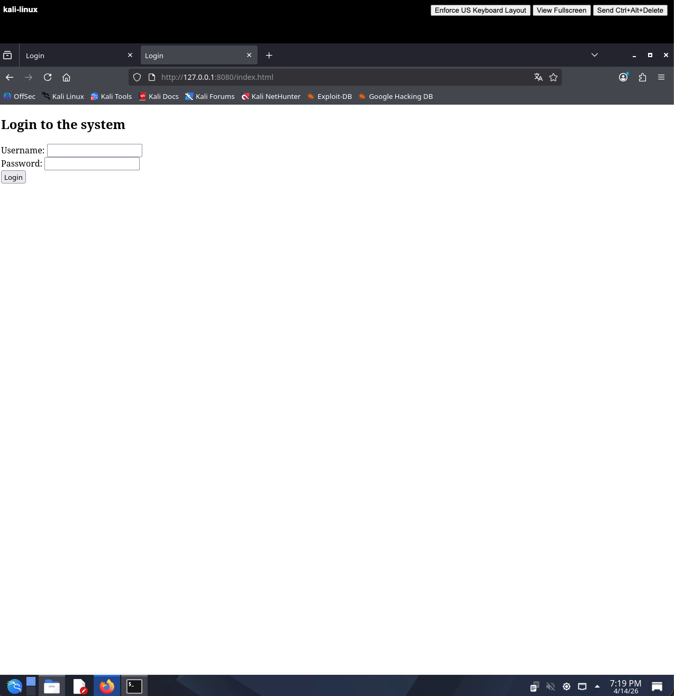

# LAB02 Solution

## 1. Preparing the test form

A file `index.html` was created with a simple login form and opened in the browser via the local filesystem.



---

## 2. Launching SET and cloning the site

Because SET's Site Cloner makes an HTTP request to clone a page, a `file://` URL cannot be used directly. The page was first served over HTTP using Python's built-in server:

```bash
cd /home/matej/lab02
python3 -m http.server 8080
```

SET was then launched in a second terminal:

```bash
sudo setoolkit
```

Menu navigation:

```
1) Social-Engineering Attacks
2) Website Attack Vectors
3) Credential Harvester Attack Method
2) Site Cloner
```

- **IP for data capture:** local machine IP
- **URL to clone:** `http://127.0.0.1:8080/index.html`

SET cloned the page and started listening on port 80. Test credentials were submitted through the browser at `http://<local_IP>`, and SET captured them immediately.



---

## 3. Cloned page in the browser

The cloned page was opened by navigating to `http://<local_IP>` in the browser. It looked identical to the original form but was now served by SET over HTTP.



---

## 4. Reflection and Analysis

**What are the characteristics of phishing pages (e.g., a wrong URL)?**

The most obvious indicator is the URL. A legitimate site uses its own domain (e.g. `https://bank.com`), while a phishing page typically shows a local IP address, an unfamiliar domain, or no HTTPS. Other signs include missing favicons, slightly different page styling, browser security warnings, and the absence of a valid TLS certificate.

**How would you protect yourself from such an attack?**

Always check the full URL before entering credentials. Use a password manager — it will refuse to autofill credentials on a domain it does not recognise. Enable multi-factor authentication so that a stolen password alone is not enough. Keep phishing awareness training up to date.

**Why do modern sites make such attacks more difficult?**

Modern sites enforce HTTPS with HSTS, use Content Security Policy headers, and often employ anti-phishing tokens tied to the original domain. Browsers flag plain-HTTP login forms and show warnings for invalid certificates. These controls do not prevent cloning, but they make the fake page visually different and cause browser warnings that an alert user should notice.
