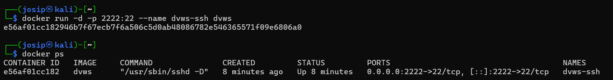
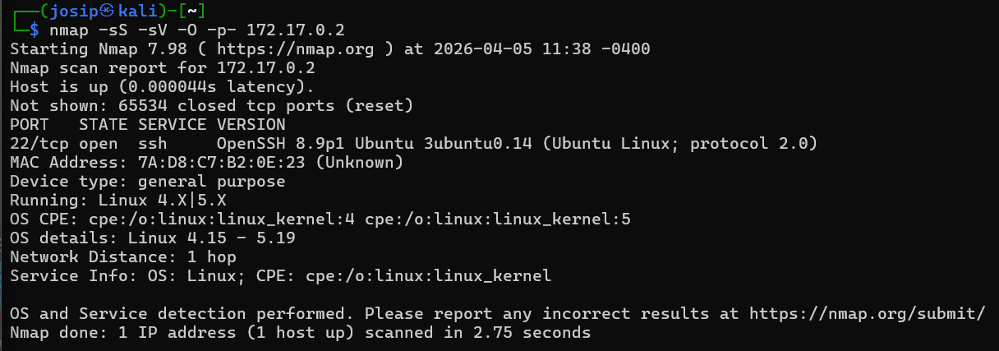
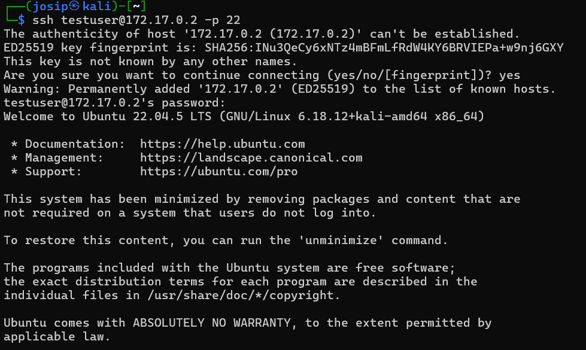
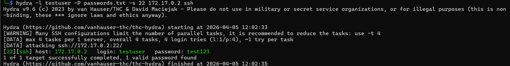

# Testing SSH Security with Nmap and Hydra

In this exercise, you will test two key techniques for testing the security of remote systems:
- detecting open ports and services with the `nmap` tool
- brute-force attacking an SSH service with the `hydra` tool

The purpose of this exercise is to show how attackers obtain information about a system and why securing the SSH service and closing unused ports is crucial for security.

---

# 🐳 Preparing the environment with Docker

Before starting the exercise, set up the target system with Docker on your host computer.
You will have a Docker image with a vulnerable SSH server that allows you to test attacks.

### 🔷 Step 0: Starting the Docker SSH Server

If you haven't already, first build a Docker image named `dvws`:
```bash
sudo apt update
sudo apt install docker-cli
sudo apt install docker.io
wget https://raw.githubusercontent.com/rpritr/KV-Vaje/refs/heads/main/lab09/dvws/Dockerfile
docker build -t dvws .
```

Then start the container:
```bash
sudo docker run -d -p 2222:22 --name dvws-ssh dvws
```

The SSH server will now be available on the host computer at `<target_ip>`, port `2222`, with user `testuser` and password `test123`.

---

# 🧪 Testing SSH Security with Nmap and Hydra

SSH (Secure Shell) is a standard protocol for remote login to a server. Weak passwords or open unnecessary services allow attackers to quickly gain access.
In this exercise, you will first use `nmap` to identify open ports and services, and then use `hydra` to check the strength of passwords.

---

## 1️⃣ Introduction

The goal is for users to learn how to:
✅ Use Nmap to detect open ports and services
✅ Use Hydra to check SSH passwords
✅ Understand the dangers of weak passwords and open services

---

## 2️⃣ Activity

### 🖥️ Instructions

Students will perform the following steps and document the results:


---

### 🔷 Step 1: Scan for open ports with Nmap

First, check which services are available on the target system:

```bash
nmap -sS -sV -O -p- <target_ip>
```

Parameters:
- `-sS` — SYN scan (quieter)
- `-sV` — detect service versions
- `-O` — detect operating system (if possible)
- `-p-` — scan all ports (1-65535)



Write down:
- which ports are open
- which services are running
- which operating system version was detected

Port 22 is open, ssh service is running and Ubuntu Linux has been detected.

💡 Reflection: why close unused ports? 

To prevent accidental exposure when creating a new service and to not give any response.

We can find the IP of the server inside the docker environment with the command
```bash
sudo docker inspect dvws-ssh | grep IPAddress
```
---

### 🔷 Step 2: Verify SSH connection

Make sure SSH service is working:
```bash
ssh testuser@<target_ip> -p 22
```
Password: `test123`


---

### 🔷 Step 3: Create a password list

For a faster test, create your own password list:
```bash
echo -e "password
123456
test123
admin" > passwords.txt
```

---

### 🔷 Step 4: Brute-force attack with Hydra

Use Hydra to attack:
```bash
hydra -l testuser -P passwords.txt -s 22 <target_ip> ssh
```

Parameters:
- `-l testuser` — username
- `-P passwords.txt` — password list
- `-s 22` — number port
- `<target_ip>` — Server IP address
- `ssh` — protocol

On success, Hydra will print something like this:
```
[22][ssh] host: <target_ip> login: testuser password: test123
```

---

## 3️⃣ Analysis and report

Submit a report with the following contents:
- Output of `nmap` results (which services/ports are open)
- Output of `hydra` results (whether the password was found)
- Screenshots of both results
- Short comment: why using weak passwords is dangerous and why closing unused ports


- Screenshots of both results have been provided under corresponding tasks
- Weak passwords are dangerous because they can be cracked quickly via brute force or dictionary attacks.
- We should close unused ports just in case, this will reduce the attack surface.

---

## 4️⃣ Reflection and analysis

- How would you protect the SSH server from brute-force attacks?
- What additional measures (e.g. limits on the number of logins, use of public-private keys, firewall) would you recommend?
- How does the result change if we use a very strong password?

I would protect the SSH servers from brute-force attacks by having VPN like twingate, so there is no need for public IP, changing the default port which is questionable measure, definetly only allow key based login, SSH can be protected with MFA or with port knocking, only allow inbound IPs of company and so on.
Attacker just needs more time, without rate limit eventually he would break it. Maybe until that time is reached sun will die, but still :D.