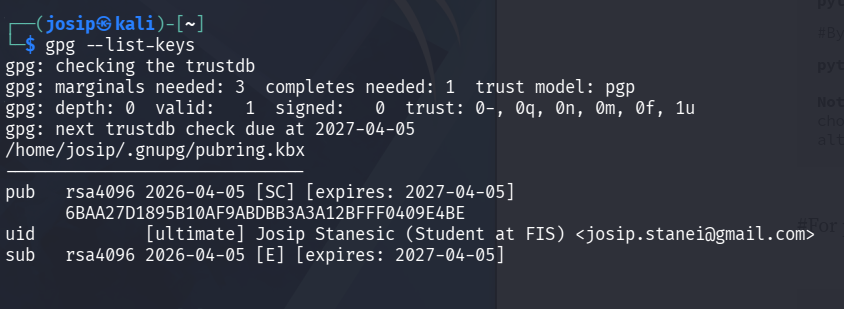
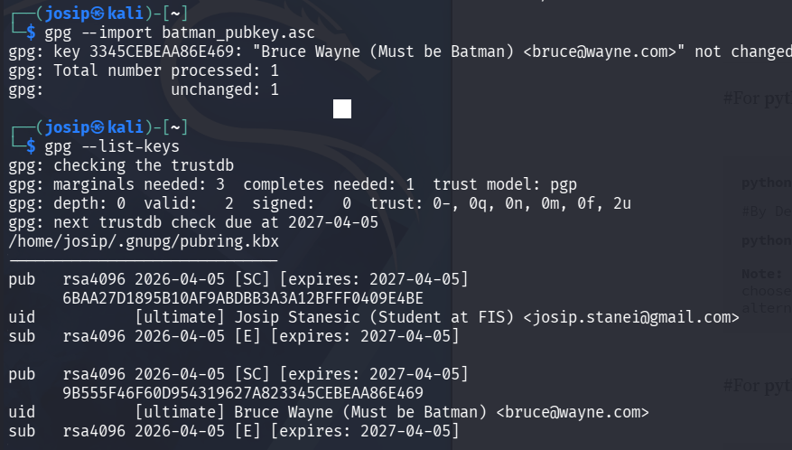
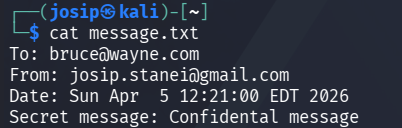
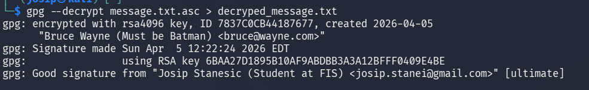
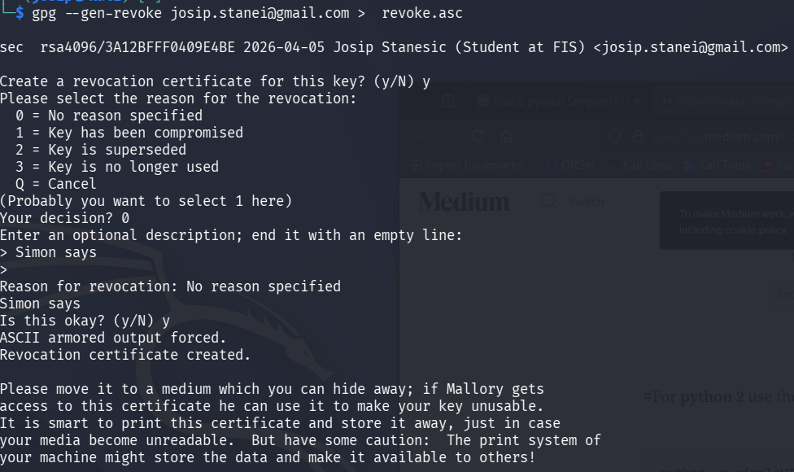
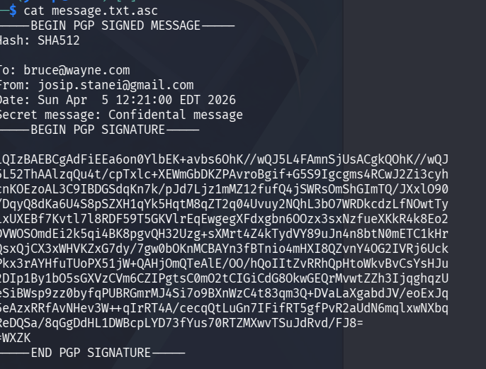
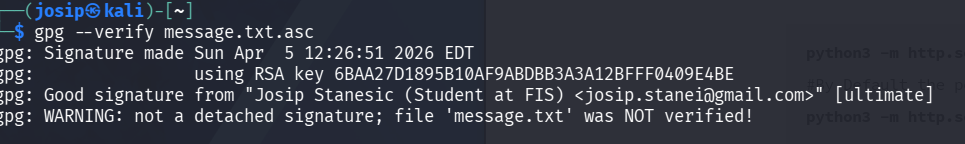

# GPG: Key Generation, Encryption, and Signing

## 🎯 Exercise Objective
In this exercise, you will practically use **GPG (GNU Privacy Guard)** to:
- generate a key pair,
- export and import a public key,
- encrypt a file,
- digitally sign,
- decrypt and verify a signature.

---

## 🧰 Requirements
- Linux / Ubuntu
- `gnupg` package installed

Installation (if not already installed):

```bash
sudo apt update
sudo apt install gnupg
```

---

## ✅ 1) Generate GPG key pair

```bash
gpg --full-generate-key
```

Select:
- **Key type:** RSA and RSA
- **Key size:** 4096
- **Expiration:** 1y
- **Name:** Student Name
- **Email:** student@example.com

Check keys:

```bash
gpg --list-keys
```

---

## ✅ 2) Export and import public key

### Export public key

```bash
gpg --armor --export student@example.com > student_pubkey.asc
```

### Importing a foreign public key

```bash
gpg --import peer_pubkey.asc
```

Tip: If you don't have a foreign public key, create another one of your own, then repeat the above process with a different identity.

Verification:

```bash
gpg --list-keys
```

---

## ✅ 3) Preparing the message

```bash
echo "To: peer@example.com
From: student@example.com
Date: $(date)
Secret message: Confidential message" > message.txt
```

---

## ✅ 4) Encrypting and signing

```bash
gpg --encrypt --sign --armor --recipient peer@example.com message.txt
```

Result:
```
message.txt.asc
```

---

## ✅ 5) Decrypting and verifying the signature

```bash
gpg --decrypt message.txt.asc > decrypted_message.txt
```

```bash
cat decrypted_message.txt
```

Expected output:
```
gpg: Good signature from "Student Name <student@example.com>"
```

---

## 📝 Report preparation
Include in the report:
- commands used,
- screenshot of the terminal,
- short answers:
1. Difference between encryption and signing
2. Role of public and private key
3. What happens when an encrypted file is modified

Encryption vs Signing — Encryption hides data so only the intended recipient can read it; signing proves the sender's identity and that the data wasn't tampered with.

Public and private key roles — The private key is kept secret and used to decrypt or sign; the public key is shared openly and used to encrypt or verify signatures.

Modified encrypted file — The decrypted output becomes corrupted/garbage (or decryption fails entirely), since the ciphertext no longer maps to valid plaintext — and if a MAC/signature is present, verification fails outright.
---

## ⭐ Additional tasks

### Revocation certificate

```bash
gpg --gen-revoke student@example.com > revoke.asc
```

### Signing only (no encryption)

```bash
gpg --clearsign message.txt
```

### Verifying the signature

```bash
gpg --verify message.txt.asc
```

---

## 🧠 Summary
- Encryption provides **confidentiality**
- Digital signature provides **authentication and integrity**
- GPG uses **asymmetric cryptography (RSA)**