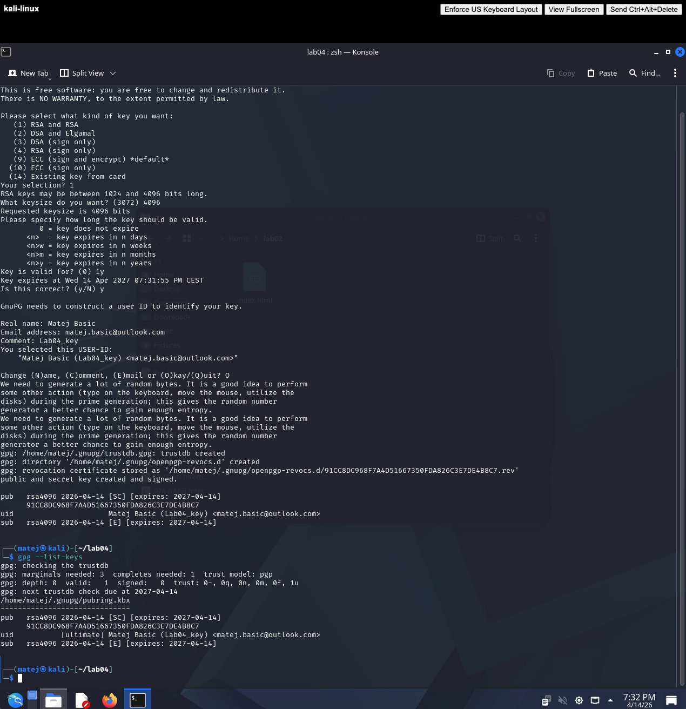
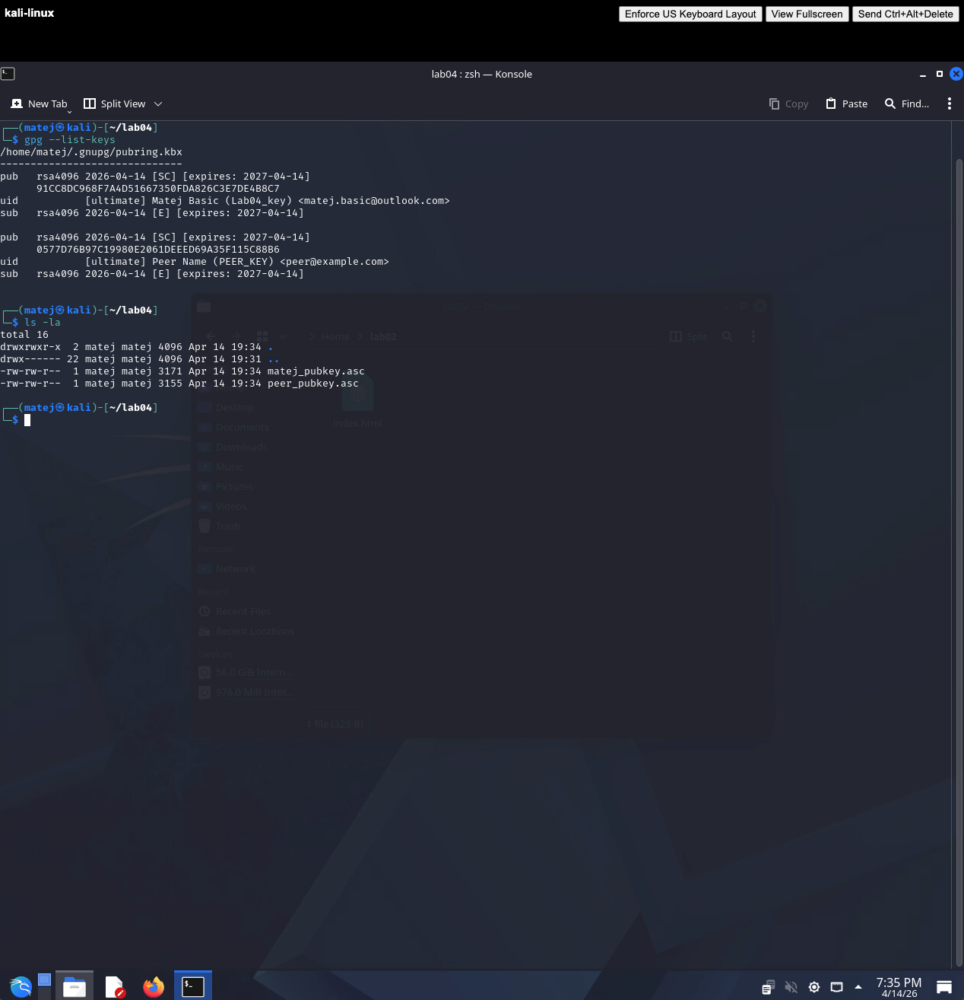
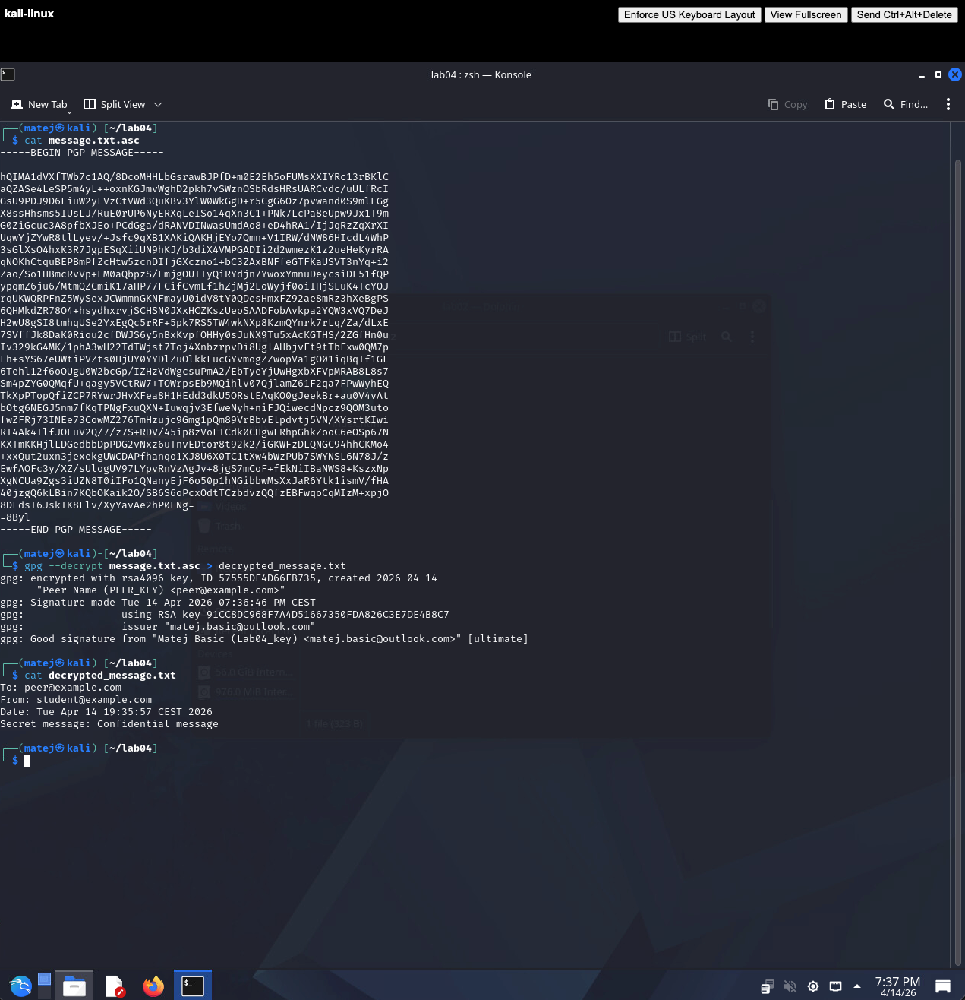

# LAB04 Solution

## 1. Generating the GPG key pair

```bash
gpg --full-generate-key
```

Options selected:
- Key type: `1` — RSA and RSA
- Key size: `4096`
- Expiration: `1y`
- Name: `Matej Basic`
- Email: `matej.basic@outlook.com`
- Comment: `lab04_key`

```bash
gpg --list-keys
```



---

## 2. Exporting and importing public keys

Since no peer was available, a second key pair was generated for `peer@example.com` to simulate the full encrypt/decrypt workflow on a single machine.

```bash
gpg --armor --export matej.basic@outlook.com > student_pubkey.asc
gpg --armor --export peer@example.com > peer_pubkey.asc
gpg --import peer_pubkey.asc
gpg --list-keys
```



---

## 3. Preparing the message

```bash
echo "To: peer@example.com
From: student@example.com
Date: $(date)
Secret message: Confidential message" > message.txt
```

---

## 4. Encrypting and signing

```bash
gpg --encrypt --sign --armor --recipient peer@example.com --local-user matej.basic@outlook.com message.txt
cat message.txt.asc
```

The output is an ASCII-armored PGP message block, unreadable without the peer's private key.


---

## 5. Decrypting and verifying the signature

```bash
gpg --decrypt message.txt.asc > decrypted_message.txt
cat decrypted_message.txt
```

GPG output confirmed:
```
gpg: encrypted with rsa4096 key, ID 57535DF4D86F8735 "Peer Name (PEER_KEY) <peer@example.com>"
gpg: Good signature from "Matej Basic (Lab04_key) <matej.basic@outlook.com>" [ultimate]
```



---

## 6. Short answers

**1. Difference between encryption and signing**

Encryption transforms the message so only the intended recipient (who holds the matching private key) can read it — it provides **confidentiality**. Signing uses the sender's private key to produce a signature that anyone with the sender's public key can verify — it provides **authenticity and integrity**. The two can be applied independently or together, as in this exercise.

**2. Role of the public and private key**

The **public key** is shared freely. Others use it to encrypt messages to you and to verify your signatures. The **private key** is kept secret. You use it to decrypt messages encrypted to you and to sign messages you send. Security relies entirely on the private key never leaving your control.

**3. What happens when an encrypted file is modified**

If even a single byte of the ciphertext is changed, decryption either fails outright or produces garbled output. When a signature is also present (as in this exercise), GPG will additionally report `BAD signature` — making tampering immediately detectable. This is why the combination of encryption and signing provides both confidentiality and integrity.
