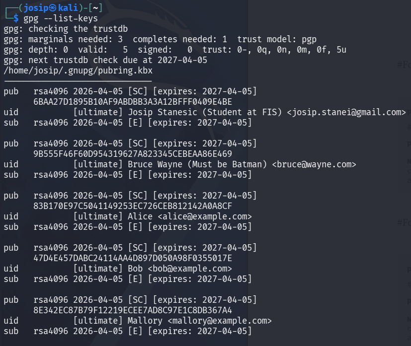
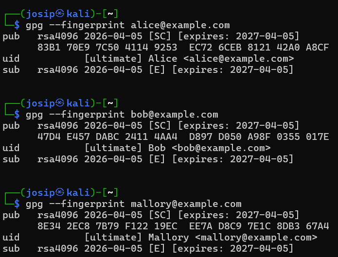
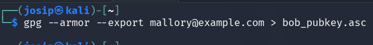
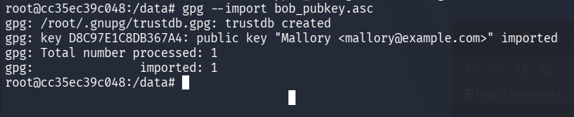
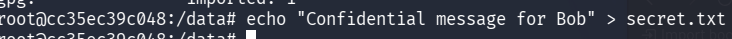
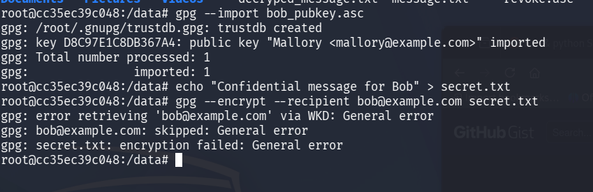

# Identifying MITM attacks on GPG keys (Web of Trust)

## 🎯 Exercise goal
The purpose of the exercise is to understand that:
- a public key in itself does not imply trust,
- MITM (Man-in-the-Middle) attacks can occur during key exchange,
- fingerprint verification is crucial,
- Web of Trust helps in detecting such attacks.

---

## 🧠 Short introduction
If an attacker manages to inject his public key instead of the real one, he can:
- read all encrypted messages,
- impersonate someone else,
- GPG cannot detect this without trust verification.

---

## 🧪 Scenario
Three people participate in the exercise:
- **Alice** – sender
- **Bob** – recipient
- **Mallory** – attacker (MITM)

Everything is done on **the same device**.

---

## 🔑 1) Key generation

Generate three GPG keys:

```bash
gpg --full-generate-key
```

Data (example):
- Alice: `alice@example.com`
- Bob: `bob@example.com`
- Mallory: `mallory@example.com`

Verify keys:
```bash
gpg --list-keys
```

---

## 🧾 2) Print fingerprints (very important)

```bash
gpg --fingerprint alice@example.com
gpg --fingerprint bob@example.com
gpg --fingerprint mallory@example.com
```

📌 Fingerprint is the only reliable way to verify a key.


┌──(josip㉿kali)-[~]
└─$ gpg --fingerprint alice@example.com
pub   rsa4096 2026-04-05 [SC] [expires: 2027-04-05]
      83B1 70E9 7C50 4114 9253  EC72 6CEB 8121 42A0 A8CF
uid           [ultimate] Alice <alice@example.com>
sub   rsa4096 2026-04-05 [E] [expires: 2027-04-05]


┌──(josip㉿kali)-[~]
└─$ gpg --fingerprint bob@example.com
pub   rsa4096 2026-04-05 [SC] [expires: 2027-04-05]
      47D4 E457 DABC 2411 4AA4  D897 D050 A98F 0355 017E
uid           [ultimate] Bob <bob@example.com>
sub   rsa4096 2026-04-05 [E] [expires: 2027-04-05]


┌──(josip㉿kali)-[~]
└─$ gpg --fingerprint mallory@example.com
pub   rsa4096 2026-04-05 [SC] [expires: 2027-04-05]
      8E34 2EC8 7B79 F122 19EC  EE7A D8C9 7E1C 8DB3 67A4
uid           [ultimate] Mallory <mallory@example.com>
sub   rsa4096 2026-04-05 [E] [expires: 2027-04-05]

---

## 🕵️ 3) MITM attack – key substitution

Mallory exports **her** public key and names it Bob's:

```bash
gpg --armor --export mallory@example.com > bob_pubkey.asc
```


Alice imports the key:
```bash
gpg --import bob_pubkey.asc
```

➡️ Alice believes she has Bob's key, but in fact she has Mallory's.

---

## 🔐 4) Alice encrypts the message

```bash
echo "Confidential message for Bob" > secret.txt
```


```bash
gpg --encrypt --recipient bob@example.com secret.txt
```

➡️ The message is encrypted with the wrong key.

The lab will not work as there is a mismatch of emails. It would work if the key was issued to Bob's email.

---

## 👀 5) Mallory decrypts the message

```bash
gpg --decrypt secret.txt.gpg
```

✔ MITM attack is successful.

---

## 🚨 6) Attack detection – fingerprint verification

Bob sends Alice **correct fingerprint via another channel** (in person, phone).

Alice checks:
```bash
gpg --fingerprint bob@example.com
```

❌ Fingerprint does not match → MITM attack detected.

---

## 🛡️ 7) Web of Trust – trust setting

Alice sets trust on the verified key:

```bash
gpg --edit-key bob@example.com
```

In the console:
```text
trust
5
quit
```

---

## 🧠 Reflection
Answer:
1. Why doesn't GPG detect MITM attacks automatically?
2. What is a fingerprint and why is it important?
3. Why is email not a secure channel for exchanging keys?
4. How does the Web of Trust reduce the risk of MITM attacks?

1. GPG can verify a message came from a specific key, but cannot determine whether that key actually belongs to the intended person — that trust must be established out-of-band.

2. A fingerprint is a short cryptographic hash of a public key that uniquely identifies it, allowing users to verify key authenticity over a trusted channel (e.g., in person) without comparing the full key.

3. Email is controlled by servers that can be compromised or intercepted, so an attacker can replace a key in transit before it reaches the recipient.

4. Web of Trust reduces MITM risk by requiring that keys be vouched for by multiple already-trusted parties, making it hard for an attacker to insert a fake key without breaking an existing chain of trust.
---

## ⭐ Additional challenge

Signing Bob's key with Alice's key:
```bash
gpg --sign-key bob@example.com
```

Explain the difference between:
- trust
- signed key
- ultimate trust

Signed key — you have verified someone's identity and cryptographically confirmed their key belongs to them.
Trust — how much you trust that person to correctly verify and sign other people's keys.
Ultimate trust — the highest trust level, assigned only to your own keys, meaning GPG treats them as unconditionally valid.

---

## 📌 Summary
- Cryptography works properly as long as we trust the right key.
- Fingerprinting is the foundation of trust.
- Web of Trust helps detect MITM attacks.