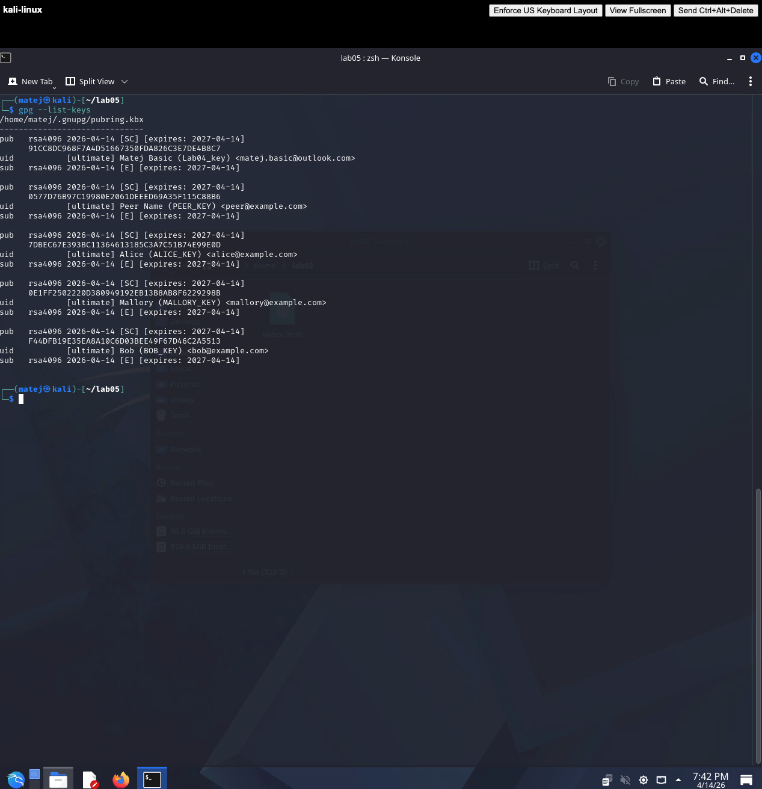
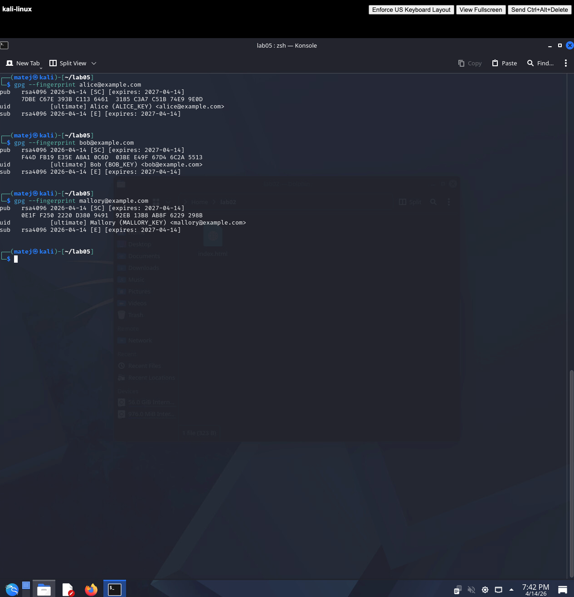
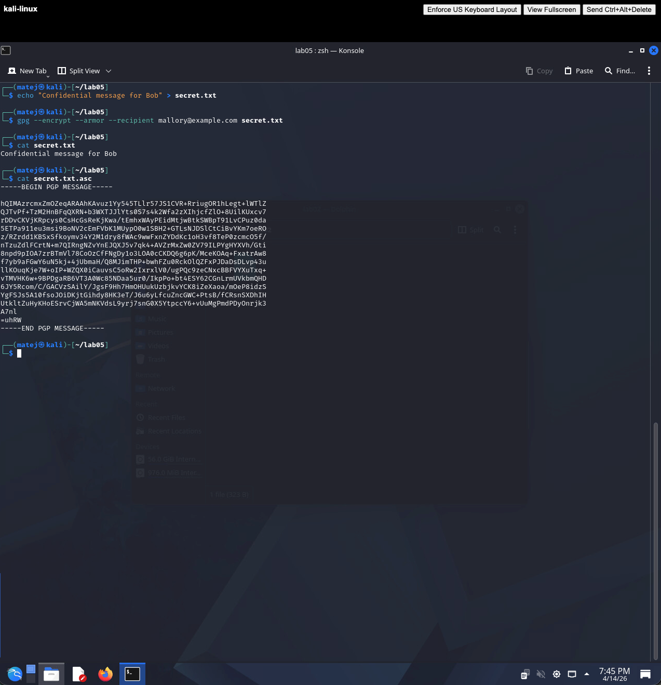
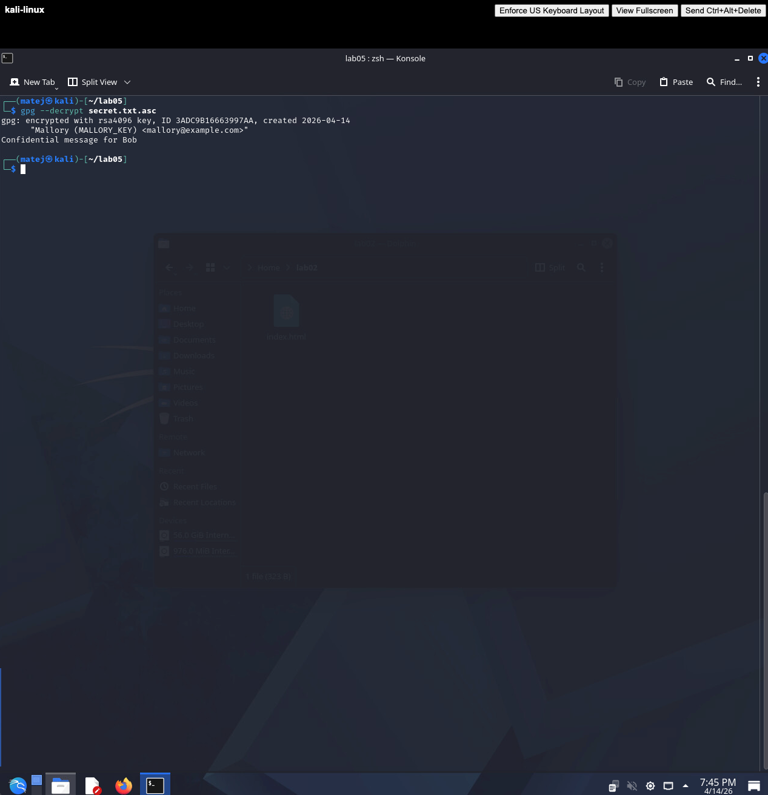
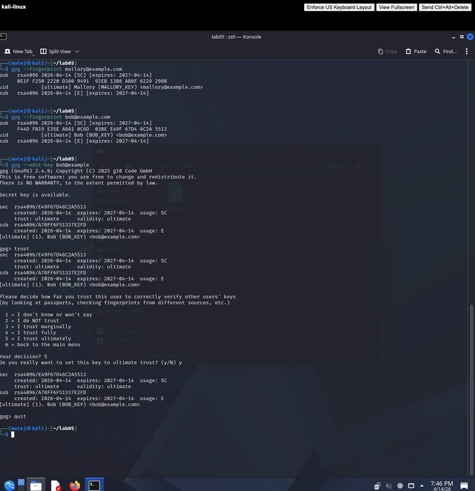

# LAB05 Solution

## 1. Key generation

Three GPG key pairs were generated on the same machine to simulate Alice, Bob, and Mallory:

```bash
gpg --full-generate-key   # Alice (ALICE_KEY) <alice@example.com>
gpg --full-generate-key   # Mallory (MALLORY_KEY) <mallory@example.com>
gpg --full-generate-key   # Bob (BOB_KEY) <bob@example.com>
gpg --list-keys
```



---

## 2. Fingerprint verification

```bash
gpg --fingerprint alice@example.com
gpg --fingerprint mallory@example.com
gpg --fingerprint bob@example.com
```



The fingerprints of Mallory and Bob are completely different — this difference is the key to detecting the MITM attack.

---

## 3. MITM attack — key substitution

Mallory exports her own public key but names the file `bob_pubkey.asc`, simulating what she would send to Alice over an untrusted channel (e.g. email):

```bash
gpg --armor --export mallory@example.com > bob_pubkey.asc
gpg --import bob_pubkey.asc
```

Alice believes she has received Bob's public key, but the file actually contains Mallory's key.

---

## 4. Alice encrypts to the wrong key

```bash
echo "Confidential message for Bob" > secret.txt
gpg --encrypt --armor --recipient mallory@example.com secret.txt
cat secret.txt.asc
```

The message is encrypted with Mallory's public key, not Bob's.



---

## 5. Mallory decrypts the message

```bash
gpg --decrypt secret.txt.asc
```

Because the message was encrypted with her key, Mallory can decrypt it without any issue:

```
gpg: encrypted with rsa4096 key "Mallory (MALLORY_KEY) <mallory@example.com>"
Confidential message for Bob
```

The MITM attack is successful — Bob never receives the message and has no idea it was intercepted.



---

## 6. Attack detection — fingerprint comparison

Bob sends Alice his real fingerprint through a trusted out-of-band channel (phone call, in person). Alice compares it against the fingerprint of the key she imported:

```bash
gpg --fingerprint mallory@example.com
gpg --fingerprint bob@example.com
```

The fingerprints do not match — the MITM attack is detected.

---

## 7. Web of Trust — trusting Bob's real key

Once Alice has verified Bob's fingerprint out-of-band, she sets ultimate trust on his real key:

```bash
gpg --edit-key bob@example.com
```

At the `gpg>` prompt:
```
trust → 5 (ultimate) → y → quit
```



---

## 8. Reflection

**1. Why doesn't GPG detect MITM attacks automatically?**

GPG is a cryptographic tool, not a trust authority. It can verify that a message was encrypted with a specific key, but it has no way of knowing whether that key actually belongs to the person named in its UID. Without a pre-established trust relationship (Web of Trust or a CA), GPG cannot distinguish a legitimate key from a substituted one.

**2. What is a fingerprint and why is it important?**

A fingerprint is a short cryptographic hash of the full public key, typically displayed as a 40-character hex string. It uniquely identifies a key — two different keys cannot share the same fingerprint. It is the only reliable way to confirm that a received public key belongs to the expected person, since a name or email address in a UID can be set to anything.

**3. Why is email not a secure channel for exchanging keys?**

Email is unauthenticated and unencrypted by default. A network attacker or a compromised mail server can intercept the message and replace the attached public key with their own before it reaches the recipient. This is exactly the scenario Mallory exploited. A secure key exchange requires either a trusted out-of-band channel (phone, in person) or a signed key from a mutually trusted third party.

**4. How does the Web of Trust reduce the risk of MITM attacks?**

Web of Trust creates a network of signed endorsements between keys. If Alice trusts Carol and Carol has signed Bob's key (having verified it in person), Alice can transitively trust that Bob's key is authentic — without ever meeting Bob directly. A MITM attacker would need to obtain signatures from multiple trusted parties on their fake key, which is far harder to achieve than simply intercepting an email.
