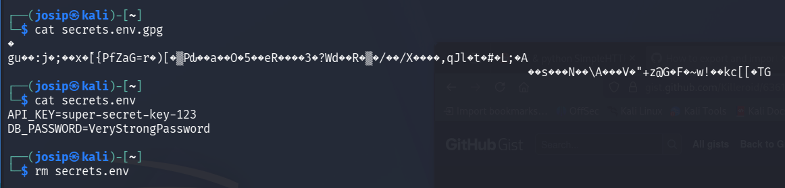
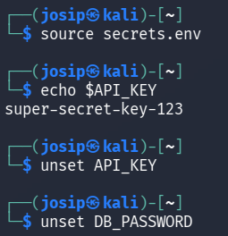
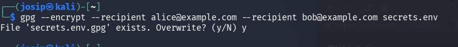
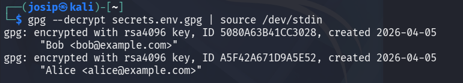

# Secrets Management using GPG

## 🎯 Exercise Objective
The exercise objective is to understand:
- what are secrets in information systems,
- why secrets do not belong in source code or repositories,
- how can we protect sensitive data using GPG,
- the basic concept of **Secrets Management** without specialized tools.

---

## 🧠 Brief Introduction
Secrets (passwords, API keys, tokens, certificates) are often:
- stored in configuration files,
- part of CI/CD environments,
- a target for attackers when hacking or leaking code.

Error:
```text
API_KEY=abc123
```
in Git repository ❌

---

## 🧪 Scenario
A company is developing an application that uses an external API.
The API key must be:
- stored locally,
- protected from unauthorized access,
- accessible only to an authorized user.

---

## 🧰 Requirements
- Linux / Ubuntu
- `gnupg` installed

Installation:
```bash
sudo apt update
sudo apt install gnupg
```

---

## 🔑 1) Prepare secrets

Create a file with secrets:

```bash
echo "API_KEY=super-secret-key-123
DB_PASSWORD=VeryStrongPassword" > secrets.env
```

⚠️ This file is in **unencrypted** form and is not secure.

---

## 🔐 2) Symmetric encryption of secrets (password)

Encrypt the file with the password:

```bash
gpg -c secrets.env
```

Result:
```
secrets.env.gpg
```

Remove the original:
```bash
rm secrets.env
```

---

## 🔓 3) Decrypt the secrets

When an application or administrator needs the secrets:

```bash
gpg secrets.env.gpg
```
The `secrets.env` file is recreated.

Or we can just print it to the screen:

```bash
gpg -d secrets.env.gpg
```

---

## 🔐 4) Asymmetric encryption (recommended)

Instead of a password, we use the public key.

```bash
gpg --encrypt --recipient student@example.com secrets.env
```

Result:
```
secrets.env.gpg
```

Advantage:
- no shared password,
- only the owner of the private key can decrypt.

---

## 🔁 5) Using secrets in an application (simulation)

Load variables into the environment:

```bash
source secrets.env
echo $API_KEY
```

After use:
```bash
unset API_KEY
unset DB_PASSWORD
```

---

## 🧪 6) Simulating a repository leak

Assume that the repository only contains:

```text
secrets.env.gpg
```

Attacker without a key:
```bash
gpg secrets.env.gpg
```

➡️ Access is not possible.

---

## 🧠 Reflection (required)
Answer:
1. Why don't secrets belong in the source code?
2. What is the difference between symmetric and asymmetric secret encryption?
3. What happens if we lose the private key?
4. How would you handle this in a larger enterprise?

1. Secrets in source code get committed to version control, making them visible to anyone with repo access — including historical commits — and they can't be rotated without changing code.

2. Symmetric uses the same key to encrypt and decrypt (fast, but sharing the key is risky). Asymmetric uses a public key to encrypt and a private key to decrypt (slower, but the private key never needs to be shared).

3. Any data encrypted with the corresponding public key becomes permanently unrecoverable — there is no mathematical way to decrypt it without the private key.

4. How would you handle this in a larger enterprise?
Use a dedicated secrets manager (e.g., Azure Key Vault, HashiCorp Vault) with access control, audit logging, automatic key rotation, and backup/recovery policies for private keys.
---

## ⭐ Additional challenge

### Multiple users
Encrypt secrets for multiple recipients:

```bash
gpg --encrypt --recipient alice@example.com --recipient bob@example.com secrets.env
```

### Automatic use (script)
```bash
gpg --decrypt secrets.env.gpg | source /dev/stdin
```

---

## 📌 Summary
- Secrets management is a key part of cybersecurity.
- GPG provides basic but effective secret protection.
- In practice, tools such as Vault, SOPS, AWS Secrets Manager are used.