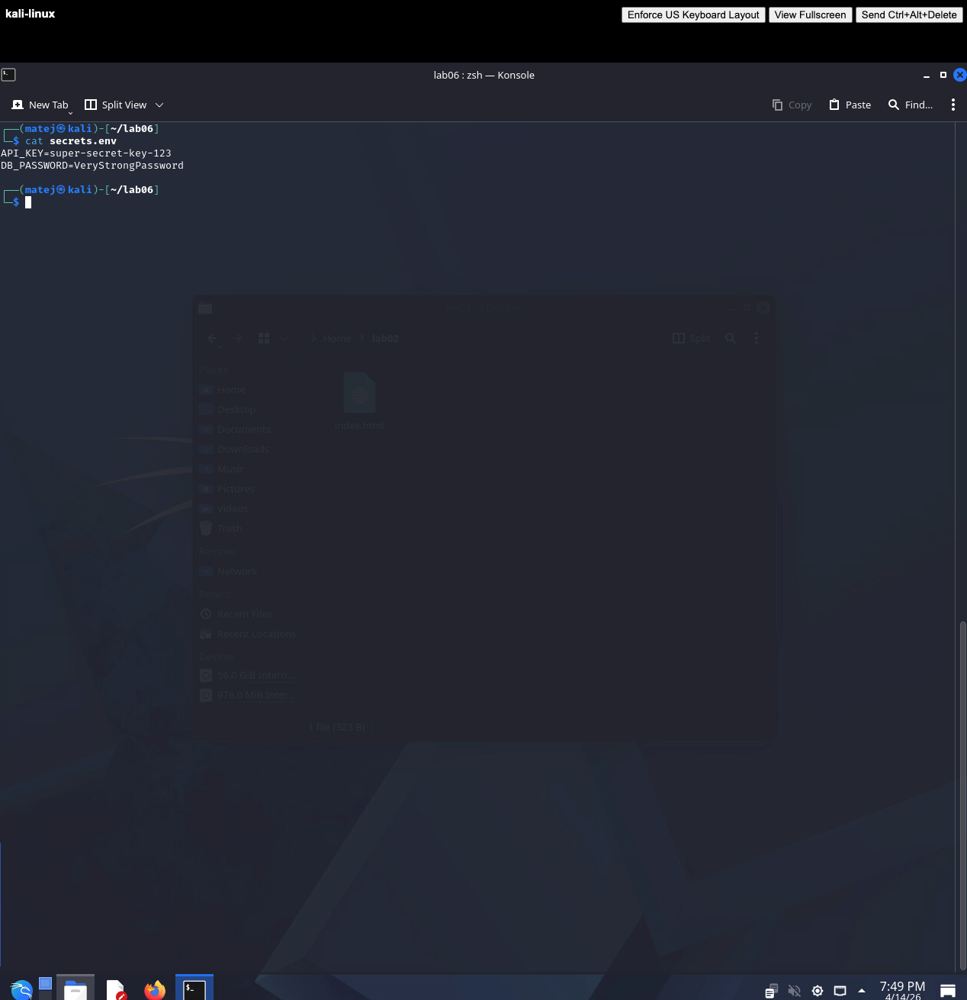
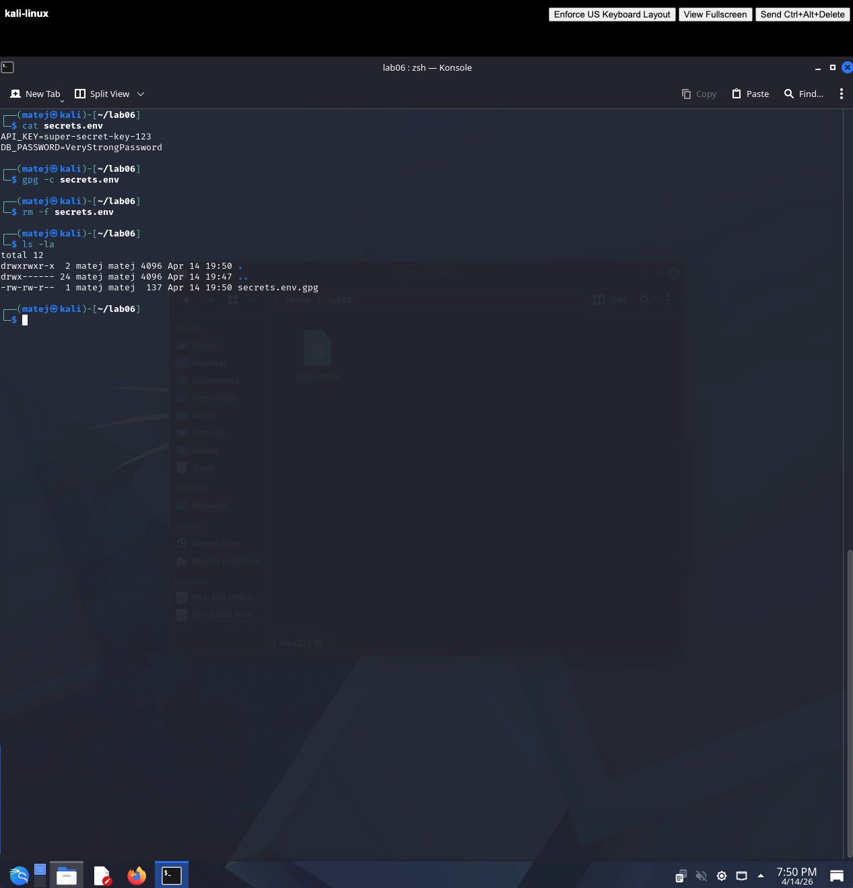
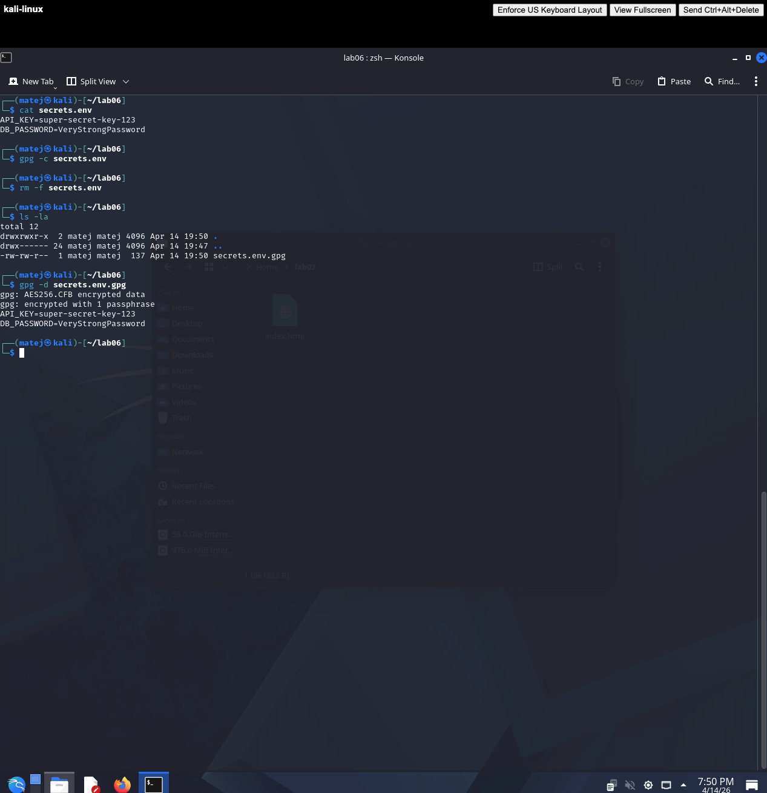
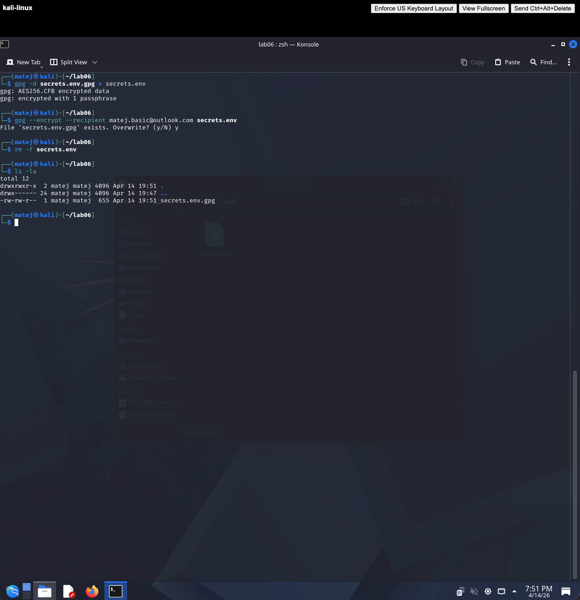
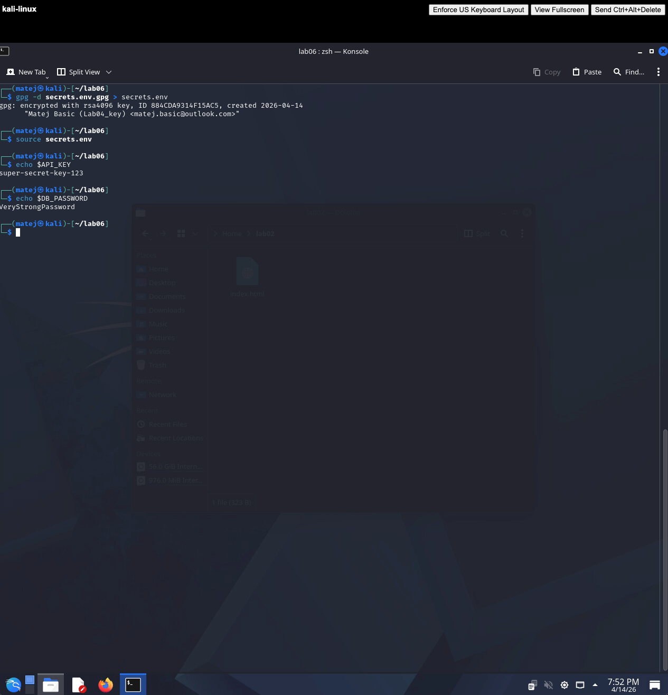
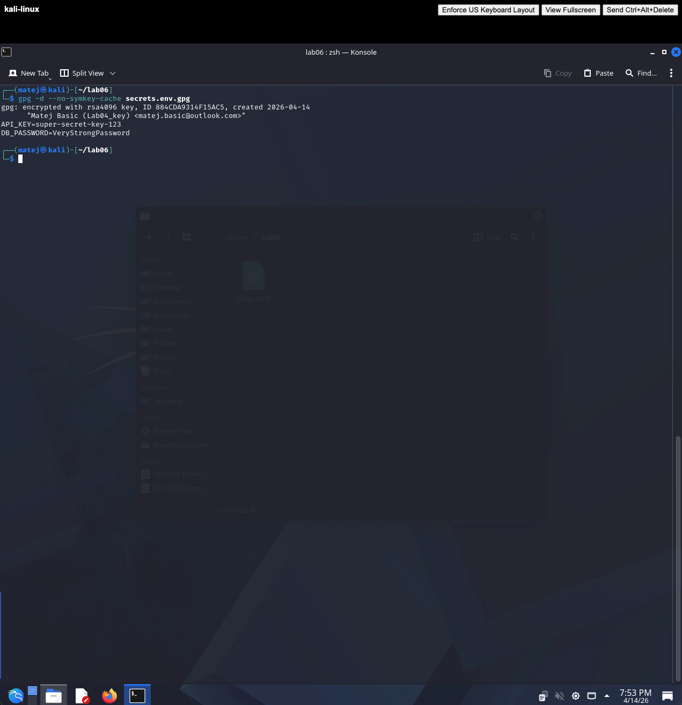

# LAB06 Solution

## 1. Preparing the secrets file

```bash
echo "API_KEY=super-secret-key-123
DB_PASSWORD=VeryStrongPassword" > secrets.env
cat secrets.env
```

The file contains plaintext credentials — visible to anyone with filesystem access. This is the problem the exercise addresses.



---

## 2. Symmetric encryption

```bash
gpg -c secrets.env
rm secrets.env
ls -la
```

GPG prompts for a passphrase and produces `secrets.env.gpg`. The original plaintext file is deleted — only the encrypted version remains on disk.



---

## 3. Decrypting the secrets

```bash
gpg -d secrets.env.gpg
```

GPG prompts for the passphrase and prints the decrypted content directly to the terminal without writing a plaintext file to disk.



---

## 4. Asymmetric encryption (recommended)

```bash
gpg -d secrets.env.gpg > secrets.env
gpg --encrypt --recipient matej.basic@outlook.com secrets.env
rm secrets.env
ls -la
```

The file is now encrypted with the public key of `matej.basic@outlook.com`. Only the holder of the matching private key can decrypt it — no shared passphrase is needed.



---

## 5. Loading secrets into the environment

```bash
gpg -d secrets.env.gpg > secrets.env
source secrets.env
echo $API_KEY
unset API_KEY
unset DB_PASSWORD
```

The secrets are decrypted, loaded into environment variables, used by the application, and then immediately cleared from memory. The plaintext file never needs to persist.



---

## 6. Simulating a repository leak

An attacker who obtains `secrets.env.gpg` from a leaked repository cannot read its contents without the private key:

```bash
gpg -d secrets.env.gpg
```

GPG reports which key the file was encrypted to — but without the private key for `matej.basic@outlook.com`, decryption fails. Only the authorised key holder can access the secrets.



---

## 7. Reflection

**1. Why don't secrets belong in source code?**

Source code is typically version-controlled and shared across teams, CI/CD systems, and sometimes made public. Once a secret is committed to a repository, it remains in the git history even after deletion — tools like `git log` or `git bisect` can surface it long after the commit is gone from the main branch. Attackers routinely scan public repositories for API keys, database passwords, and tokens.

**2. What is the difference between symmetric and asymmetric secret encryption?**

Symmetric encryption (`gpg -c`) uses a single shared passphrase for both encryption and decryption. It is simple but requires securely sharing the passphrase with every authorised party — the passphrase itself becomes a secret that must be managed. Asymmetric encryption (`gpg --encrypt --recipient`) uses a public/private key pair: anyone can encrypt with the public key, but only the private key holder can decrypt. No shared secret needs to be exchanged, which is significantly safer in team and automated environments.

**3. What happens if we lose the private key?**

Any data encrypted to that key becomes permanently inaccessible — there is no recovery mechanism. This is why private key backups and revocation certificates should be generated and stored securely (e.g. on an encrypted offline medium) before a key is used in production. In team environments, encrypting secrets to multiple recipients (`--recipient alice --recipient bob`) provides redundancy so that a single lost key does not cause a total loss.

**4. How would you handle this in a larger enterprise?**

Dedicated secrets management platforms such as HashiCorp Vault, AWS Secrets Manager, or Azure Key Vault are the standard approach. They provide centralised storage with fine-grained access control, automatic rotation of credentials, full audit logs of who accessed which secret and when, and dynamic secrets that are issued on demand and expire automatically. GPG-based encryption like in this exercise is a useful lightweight alternative for small teams or offline scenarios, but it lacks the auditability and rotation capabilities required at enterprise scale.
