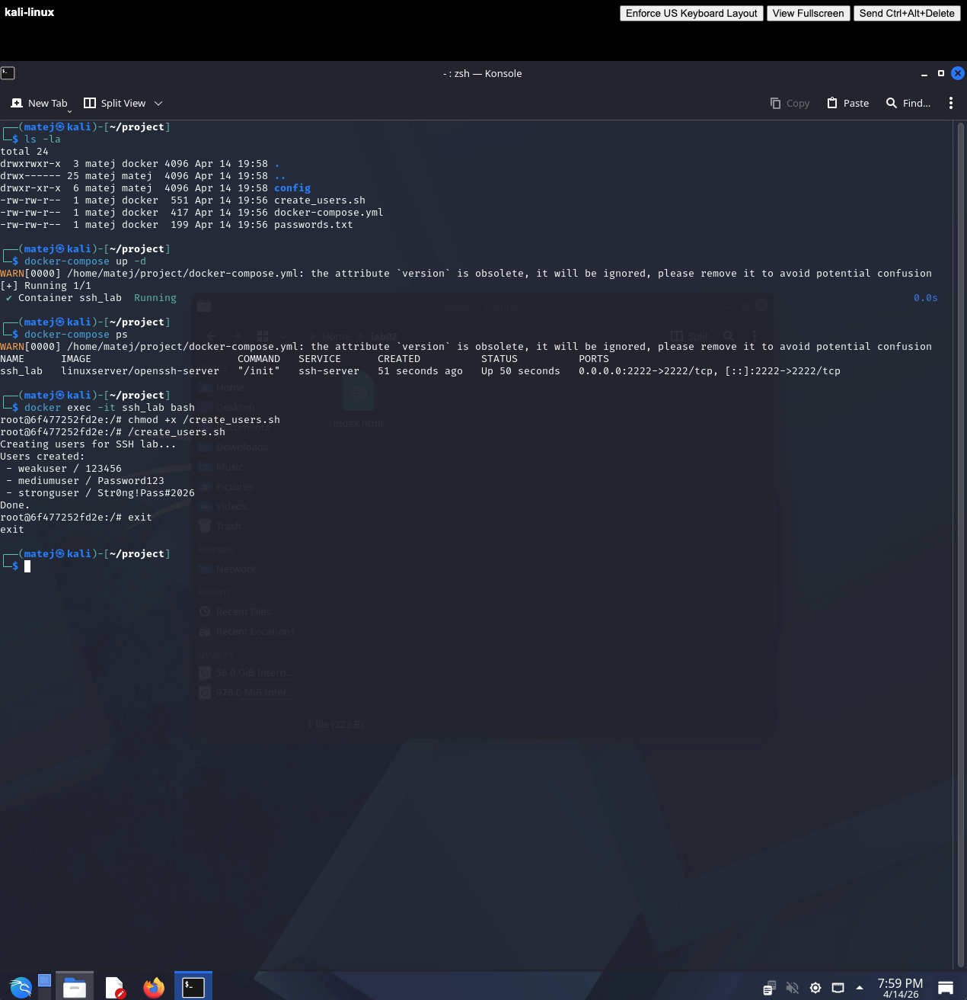
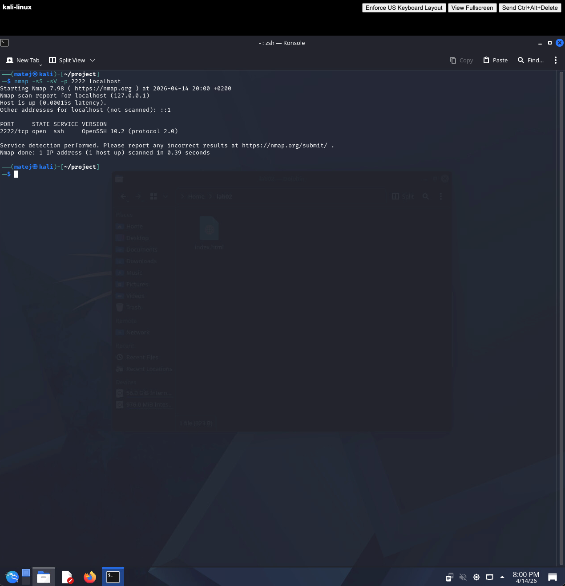
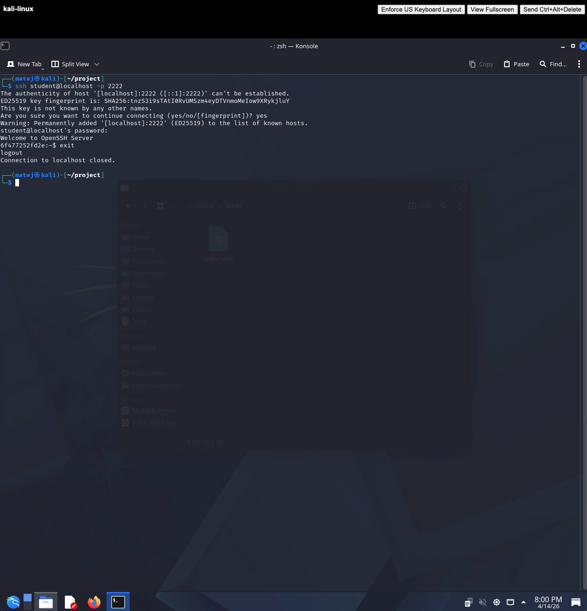
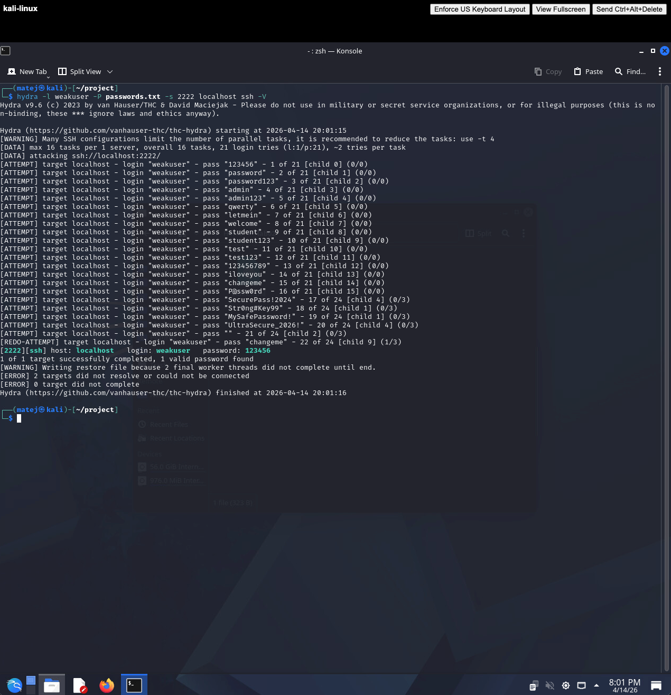
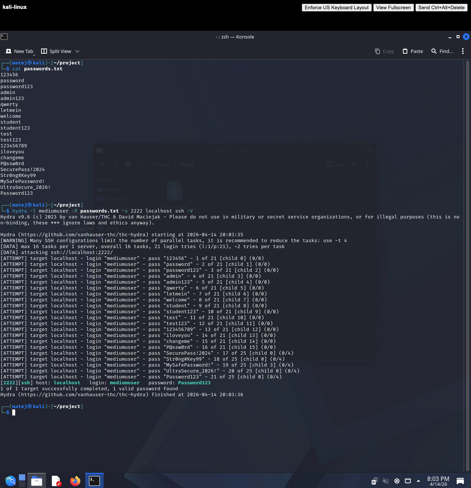
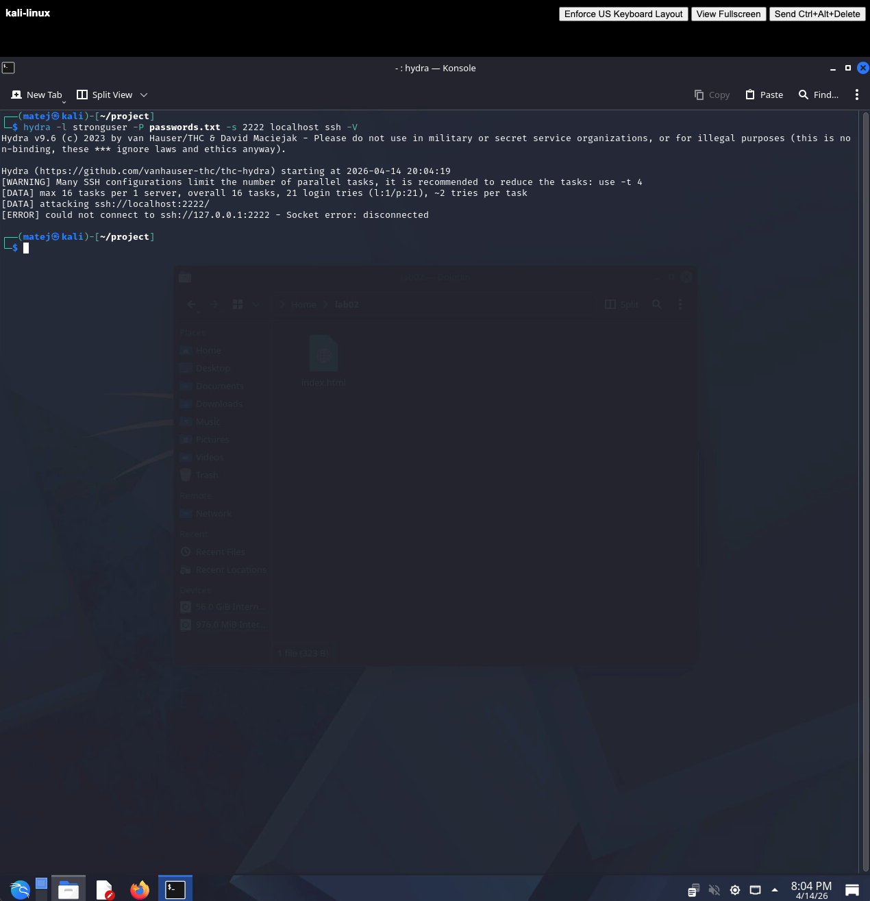
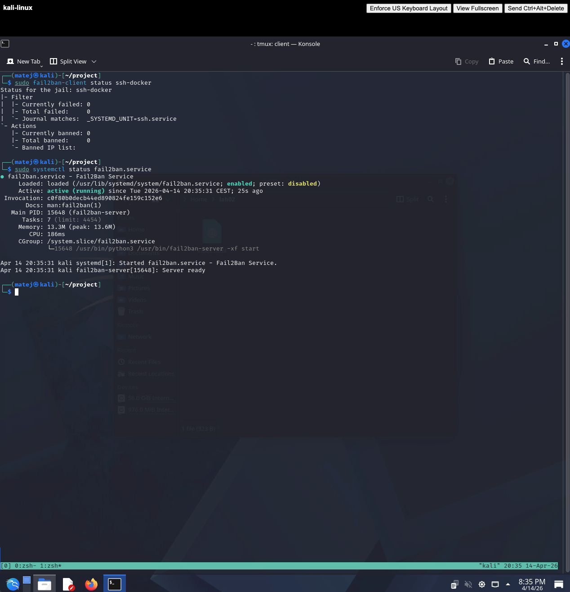
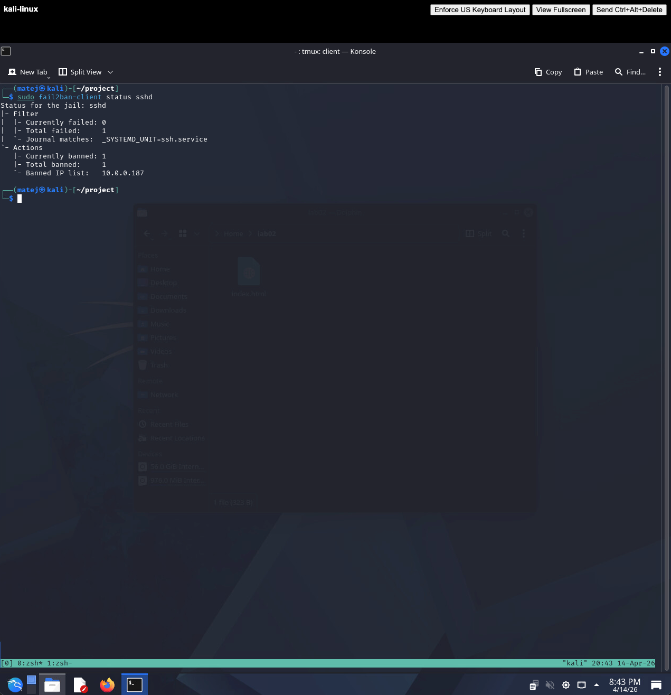

# Empirical Project: SSH Security Weakness Study

## 1. Introduction

SSH (Secure Shell) is the standard protocol for remote administration of servers and network devices. Despite being cryptographically sound, SSH services are frequently compromised not through cryptographic weaknesses but through weak credentials. Automated brute-force tools can systematically try thousands of passwords per minute, making weak passwords a critical vulnerability.

This project empirically investigates how password strength and defensive mechanisms affect the resilience of an SSH service against automated brute-force attacks. Three password configurations are tested without any protection, and a fourth experiment introduces rate-limiting via fail2ban to measure its effectiveness.

---

## 2. Methodology

### Environment

A Docker container running `linuxserver/openssh-server` was used as the target SSH server, exposing port `2222` on the host. Three test users were created with passwords of varying strength:

| User | Password | Strength |
|------|----------|----------|
| weakuser | `123456` | Weak — top-ranked common password |
| mediumuser | `Password123` | Medium — common pattern, not default |
| stronguser | `Str0ng!Pass#2026` | Strong — mixed case, symbols, digits |

### Tools

- **nmap** — service identification and port scanning
- **hydra** — automated SSH brute-force attack
- **fail2ban** — rate-limiting and IP banning defence

### Wordlist

A 21-entry `passwords.txt` was used, containing common passwords (`123456`, `admin`, `password`, `qwerty`, etc.) plus `Password123` added explicitly to test the medium-strength scenario. The strong password `Str0ng!Pass#2026` was deliberately excluded to simulate a realistic attack where the attacker does not know the password.

### Configurations tested

| Config | User | Password | Protection |
|--------|------|----------|-----------|
| 1 | weakuser | 123456 | None |
| 2 | mediumuser | Password123 | None |
| 3 | stronguser | Str0ng!Pass#2026 | None |
| 4 | weakuser | 123456 | fail2ban (maxretry=3, bantime=300s) |

---

## 3. Experiment

### Setup

```bash
docker compose up -d
docker exec -it ssh_lab bash
/create_users.sh
```



### Reconnaissance

```bash
nmap -sS -sV -p 2222 localhost
```



### SSH connection verification

```bash
ssh student@localhost -p 2222
```



### Config 1 — Weak password, no protection

```bash
hydra -l weakuser -P passwords.txt -s 2222 localhost ssh -V
```



### Config 2 — Medium password, no protection

```bash
hydra -l mediumuser -P passwords.txt -s 2222 localhost ssh -V
```



### Config 3 — Strong password, no protection

```bash
hydra -l stronguser -P passwords.txt -s 2222 localhost ssh -V
```



### Config 4 — fail2ban active

fail2ban was configured with a custom `ssh-docker` jail monitoring the SSH service journal, with a threshold of 3 failed attempts before a 300-second ban.

```bash
sudo fail2ban-client status ssh-docker
sudo systemctl status fail2ban.service
```



After the attack, the attacker IP was banned:

```bash
sudo fail2ban-client status sshd
```



---

## 4. Results

| Config | User | Password | Protection | Success | Time | Attempts |
|--------|------|----------|-----------|---------|------|----------|
| 1 | weakuser | 123456 | None | Yes | ~55s | 21 |
| 2 | mediumuser | Password123 | None | Yes | ~35s | 21 |
| 3 | stronguser | Str0ng!Pass#2026 | None | No | — | 21 |
| 4 | weakuser | 123456 | fail2ban | No | — | 3 |

**Key observations:**

- **Config 1:** The password `123456` is the first entry in the wordlist. Hydra found it on the very first attempt — the only reason the total time was ~55 seconds is SSH connection overhead across 21 parallel threads.
- **Config 2:** `Password123` was at position 21 (last entry). Hydra had to exhaust the entire wordlist, but still succeeded — demonstrating that a password is only as safe as the wordlist used against it.
- **Config 3:** `Str0ng!Pass#2026` does not appear in any common wordlist. Hydra completed all 21 attempts with no result. A full character-space brute-force would be computationally infeasible online.
- **Config 4:** fail2ban banned the attacker after exactly 3 failed attempts, preventing any further login attempts for 300 seconds.

---

## 5. Discussion

### Impact of password strength

Password strength directly determines whether a dictionary attack succeeds. A weak password like `123456` is cracked nearly instantly because it appears at the top of every common wordlist. A medium password like `Password123` follows a predictable pattern (capitalised word + digits) and appears in extended wordlists — it provides no real security against a targeted attack. A strong, randomly composed password that does not appear in any wordlist is immune to dictionary attacks entirely, leaving only computationally infeasible exhaustive search as an option.

### Effectiveness of fail2ban

fail2ban proved immediately effective: the attacker's IP was banned after 3 attempts, well before Hydra could make any meaningful progress. With a ban time of 300 seconds and only 3 attempts per window, an attacker would need over 1,750 hours to try the 21 passwords in the wordlist sequentially — rendering online brute-force impractical.

However, fail2ban does not prevent the attack completely:

- **Distributed attacks:** An attacker controlling a botnet can distribute attempts across thousands of IP addresses, staying below the `maxretry` threshold on each one.
- **IP spoofing / VPN rotation:** Attackers can rotate IPs to bypass per-IP bans.
- **Slow attacks:** By spacing attempts beyond the `findtime` window, an attacker avoids triggering the ban entirely.

### Security vs usability trade-off

Stricter fail2ban settings (lower `maxretry`, longer `bantime`) improve security but increase the risk of locking out legitimate users who mistype their password. In production environments, `maxretry = 5` with `bantime = 1h` is a common balance. Whitelisting known administrator IPs with `ignoreip` prevents accidental self-lockout.

---

## 6. Conclusion

This experiment confirmed that password strength is the single most critical factor in SSH security. A weak password is cracked in seconds regardless of any other configuration. A strong password that does not appear in wordlists is effectively immune to online dictionary attacks.

fail2ban adds a meaningful layer of defence by eliminating the attacker's ability to iterate through passwords quickly, but it is not a substitute for strong passwords — it is a complementary control.

### Recommendations

1. **Enforce strong passwords** — require a minimum of 16 characters with mixed case, digits, and symbols, and reject passwords that appear in known breach databases.
2. **Disable password authentication entirely** — use public-key authentication only. This makes brute-force attacks against SSH credentials structurally impossible.
3. **Deploy fail2ban or equivalent rate limiting** — even with key-based auth, rate limiting protects against enumeration and reduces log noise.
4. **Restrict SSH access by IP** — use a firewall to allow SSH only from known administrator IP ranges, eliminating exposure to the public internet.
5. **Move SSH off port 22** — while not a security control, running SSH on a non-standard port (e.g. 2222) eliminates the vast majority of automated scanning traffic.
